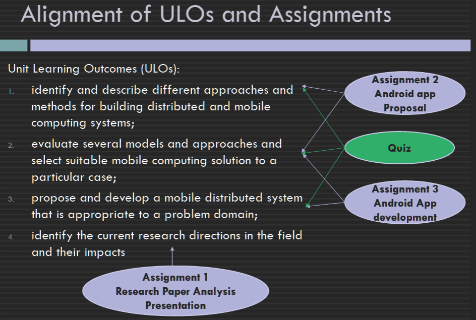
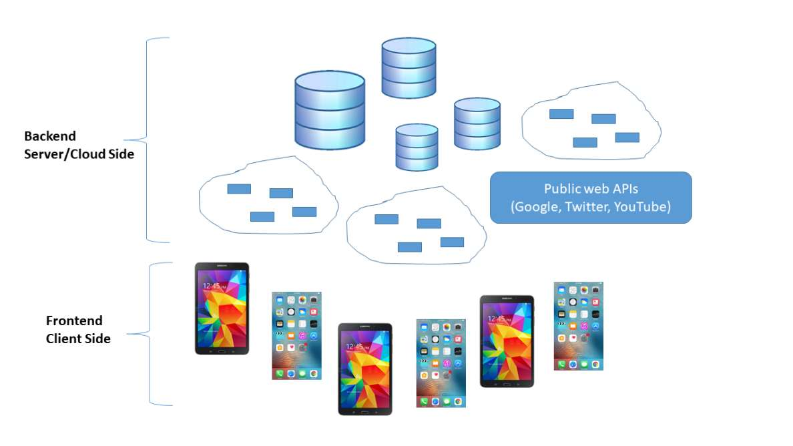
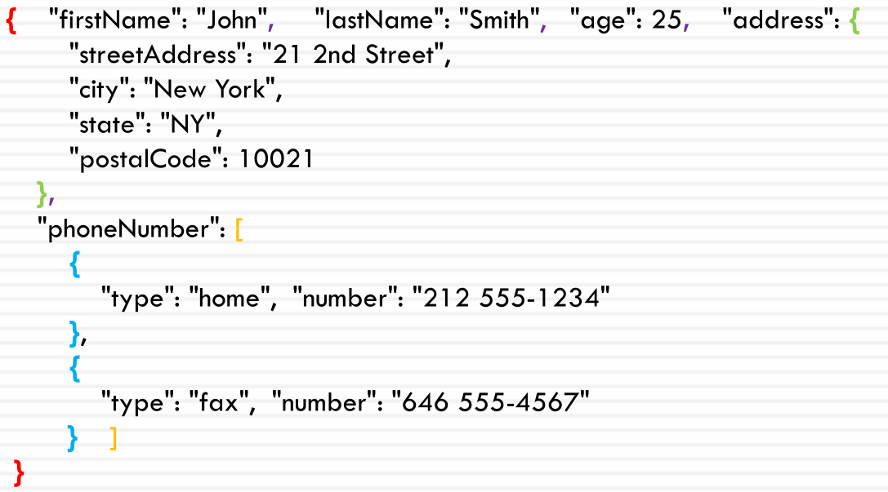
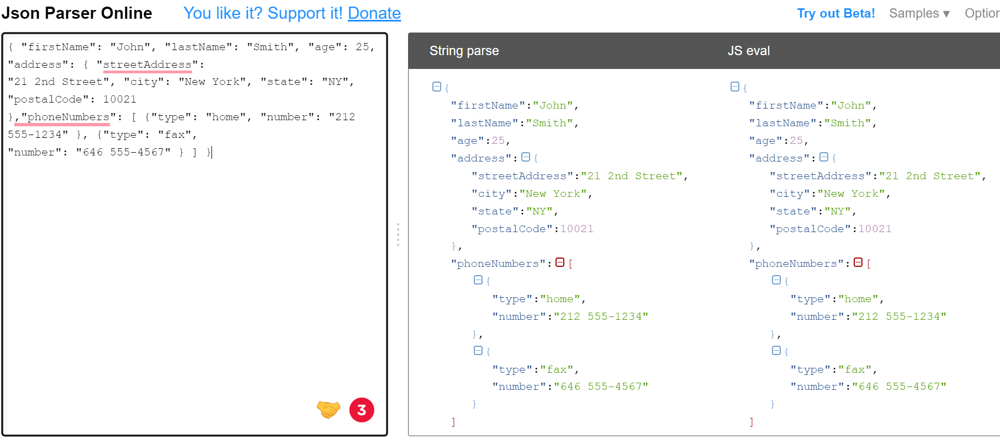

Create time: 2023-02-24  Last update: 2023-02-24

# How to use the FIT study Note document
1. download the [markdown file repository](https://github.com/GreenH47/mynote) and  navigate to the `docs` folder
2. view all the markdown files via [Obsidian vault](https://help.obsidian.md/How+to/Working+with+multiple+vaults) that can show the linked section in the note document    
3. You may find some extra material or program template  repository in the Course Brief introduction for the FIT Note markdown Document (some course don't have )

4. you can view [the web page](https://greenh47.github.io/mynote/) which transfer from MD file online but will lose the extra information or wrong    markdown display

  
# FIT5046 - Mobile and distributed computing systems Course Brief introduction

## outline
  
  

This unit focuses on the most current and key topics in mobile and distributed computing. We will mainly focus on learning key concepts of mobile computing using Android, and then look at ubiquitous and context-aware computing, IoT, wireless sensors, and location-aware computing. While we will discuss these topics in the lectures, you will learn practically in the labs how to create and develop a mobile, distributed Android app. Each semester we develop a real world and useful mobile app for Android platforms.

[FIT5046 - Mobile and distributed computing systems](https://handbook.monash.edu/2023/units/FIT5046?year=2023) done for the year 2023. (Semester 1)  
## software and Programming Language for the unit
+ Android Studio Electric Eel, 2022.1.1 (stable version) SDK 13  API 33  [Android Studio Electric Eel | 2022 年 1 月 1 日  |  Android 开发者  |  Android Developers](https://developer.android.com/studio/releases)  
+  Java The original language  
+   Kotlin  We learn the Kotlin code by comparing to Java and only  limited to the lecture topics

# week 1 Introduction to Mobile and Distributed Computing
## exercise
  

## Learning Objectives:
+ what is a distributed system? what is a mobile and distributed system?   
+ what are the main architectures/models for developing mobile and distributed systems?  
+ What is a web service? why are web services important in developing distributed and mobile systems?  
+ What is REST? What are the architectural constraints of REST? What are the interface constraints of REST?  
+ The role of JSON in web services?  
## lecture
An Overview of Distributed Systems  
An Overview of Mobile and Distributed Computing  
Web Services  
### Distributed Computing
A computing paradigm where a number of autonomous  entities (most likely heterogeneous)  which are geographically distributed  can communicate and exchange messages  through a computer network  to achieve certain related tasks (common goals)
+ Vertical distribution: placing logically different layers/components on different machines  Each layer on one single machine  
+ Horizontal distribution: a single logical layer/component is distributed across multiple machines to improve scalability E.g. distributing a database on multiple machines (distributed database   
### Mobile and Distributed Computing
+ It is a class of distributed computing systems. It integrates mobile and wireless devices into distributed systems (Wireless sensor, smart device)  
+ Mobile computing is associated with mobility of hardware, users,data, applications and network in computer applications  
### Distributed Computing Models
The client/server model  
+ Server processes offer  services to clients processes  
+ Usually there is a data storage at the backend  
+   

Peer-to-peer
+ Each process logically equal to each other  
+ Data flows between the processes  
+ 

### SOA  (Service-Oriented Architecture)
Service-oriented architecture was introduced as a paradigm  for distributed systems  
+ Application functionalities (software components) are provided as  services (independent modules)  
+ <mark style="background: #0000CD;">Exposed to public (clients) using a standard interface protocol,  aka an application programming interface (API)</mark> 
+ <mark style="background: #3CB371;">Message based interactions through these interfaces</mark>  
+ Reuse of services and composition of services  
+ Interoperability to support different platforms
### web service
+ SOA is implemented by creating web services  
+ “A Web service is a piece of software/code designed to <mark style="background: #0000CD;">support  interoperable machine-to-machine interaction over a network</mark>”  <mark style="background: #0000CD;">(W3C) </mark> 
+ Web services <mark style="background: #ff0000;">provide a standard interface to make the  functionalities available to the public (clients)  </mark>
+ Web services provide access to business logic, data and processes  or other services  
+ Web services were originally <mark style="background: #3CB371;">implemented as SOAP web services  and later evolved into RESTful web services (RESTful Web APIs)  </mark>
### REST (REpresentational State Transfer)
+ REST is not a protocol, a technology, a standard, or a specification  
+ The architecture consists of elements and relationships between these  elements  
+ <mark style="background: #0000CD;">The REST architecture’s constraints that control the roles the  roles/features of these elements and also their allowed relationships  ( Architectural Constraints   Interface Constraints  ) </mark> 
+ While REST is not a standard, it uses standards(HTTP  URL  XML)  
### REST and Resources
A resource:  
Any information that can be named can be a resource  

A resource identifier:  
Each resource becomes accessible via a URI/URL  

A representation:  
+ It is a document capturing the current state of a resource  
+ A resource can have different representations (e.g. JSON or XML) 

REST (REpresentational State Transfer):  
+ each resource state has a representation, and this  representation can be updated and transferred from the  server to the client application

### Architectural Constraints
+ Client/Server  
+ Stateless  
+ Cache  
+ Uniform Interface  
+ Layered Systems  
+ Code-On-Demand   
#### Client/Server


### JSON
+ JSON stands for JavaScript Object Notation  
+ JSON is lightweight text-data interchange format  
+ JSON is "self-describing" and easy to understand  
+ A value can be a string, a number, true/false or null, an object or an array  值可以是字符串、数字、true/false 或 null、对象或数组
+  Data is separated by commas  数据以逗号分隔
+  Curly braces hold objects and square brackets hold array 大括号包含对象，方括号包含数组  
+ 
### JSON structures
Objects: a collection of name/value pairs Objects in name/value pairs , each name is followed by a colon   
```json
{"firstName": "John"}
```

Arrays: an ordered list of values  
```json
{"phoneNumber": [
{
"type": "home", "number": "212 555-1234"
},
{
"type": "fax", "number": "646 555-4567"
} ] }
```
### JSON Data Types
+ a string `{ "name":"John" }`  
+ a number `{ "age":30 }`  
+ a Boolean `{ "sale":true }`  
+ null `{ "middlename":null }` 
+ an object (JSON object) `{  
"address": {  
"streetAddress": "21 2nd Street", "city": "New York", "state": "NY", "postalCode": 10021 }} `  
+ 

### Parsing JSON
```json
{ "firstName": "John", "lastName": "Smith", "age": 25, "address": { "streetAddress":  
"21 2nd Street", "city": "New York", "state": "NY", "postalCode": 10021  
},"phoneNumbers": [ {"type": "home", "number": "212 555-1234" }, {"type": "fax",  
"number": "646 555-4567" } ] }
```
[Json Parser Online](http://json.parser.online.fr/)  
[Site Unreachable](https://jsoneditoronline.org)  
  

In Android, we will use org.json libraries `import org.json.JSONObject;`  
The JSONObject class is used to create or parse JSON  
```kotlin
JSONObject jsonObject = new JSONObject(result);  
JSONArray jsonArray = jsonObject.getJSONArray("items");  
if(jsonArray != null && jsonArray.length() > 0) {  
snippet =jsonArray.getJSONObject(0).getString("snippet");  
}
```

## tutorial
1. system image (try to use Tiramisu version API 33).    
2. device (pixal_3a)  
3. change the Android application’s title `res/values/strings.xml` change the value of the `app_name t` and  rerun the app  
4. change the message `res/layout/activity_main.xml`   
5. 
# Assignment 1: Research Paper Analysis Presentation (Weight: 15%) - Due 27/03/2023 4:30pm
## requirement
Assignment 1  - Research Paper Presentation (15%)   
Presentations in your allocated lab in Week 5  (on-campus students must present in person and online students will present online via Zoom)  
This is a group assignment (group of 2), where each group member will present their own slides (5 minutes each).   
Your group member should be from the same lab.  
Attendance in Week 5 lab is compulsory.  
This assignment uses questions at the end of the presentation as the method of validation.  
[Monash University - 登录](https://lms.monash.edu/mod/assign/view.php?id=11206852)  
