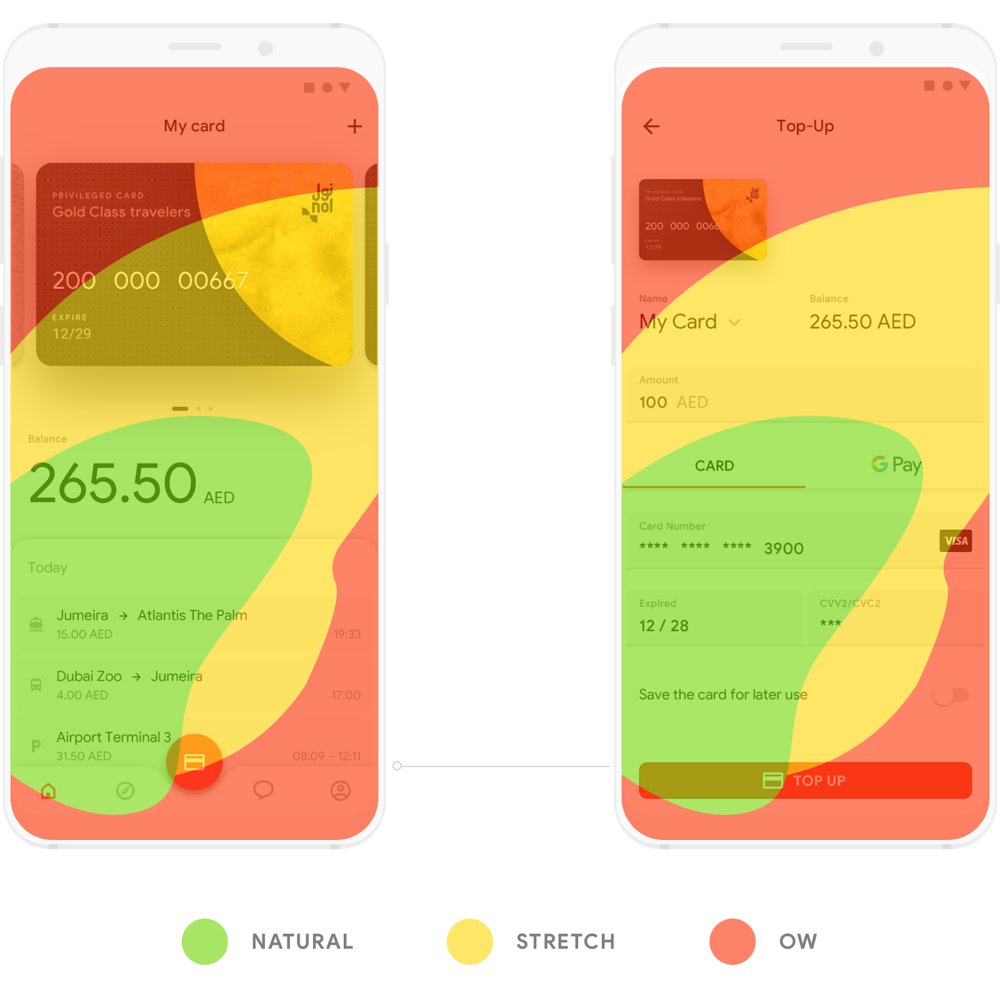
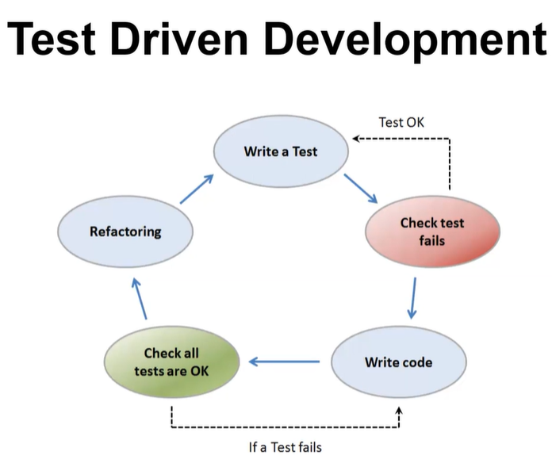

# FIT5120 Industry experience studio project - S2 2023  
[FIT5120 - Industry experience studio project - Monash University](https://handbook.monash.edu/2023/units/FIT5120)  

|Week 周|Project Phase 项目阶段|Topic 主题|
|---|---|---|
|1|Onboarding 入职培训|- Unit expectations - Design thinking principals - Teamwork - Leankit   - 单位期望-   设计思维原则   - 团队合作   - 精益|
|2|Onboarding 入职培训|- Agile - Meeting cadences - Iteration planning - User journey - Peer reviews - Acceptance testing   - 敏捷 -   会议节奏 -   迭代规划 -   用户旅程 -   同行评审   - 验收测试|
|3|Expo/Go-Live Onboarding 博览会/上线入职|- UI/UX fundamentals - Integrity testing - Retrospectives   - UI/UX 基础知识 -   完整性测试   - 回顾|
|4|IM Proposal IM 提案|- Importance of understanding your users - How to pitch your idea - Iteration expectations   - 了解用户的重要性 -   如何推销您的想法   - 迭代期望|
|5|Iteration 1 迭代 1|- Copyright - IP - Effort estimation   - 版权-   知识产权   - 工作量估算|
|6|Iteration 1 迭代 1|- Agile manifesto - Quality assurance - Being innovative with open data   - 敏捷宣言 -   质量保证   - 利用开放数据进行创新|
|7|Iteration 2 迭代 2|- Customer collaboration - Systems thinking - Integrity testing   - 客户协作-   系统思维   - 完整性测试|
|8|Iteration 2 迭代 2|- Learning journey expectations - Importance of continuous improvement - Handover expectations   - 学习之旅期望-   持续改进的重要性   - 交接期望|
|9|Iteration 3 迭代 3|- Storytelling through data - How to demo a product - Deep dive into quality assurance   - 通过数据讲故事 -   如何演示产品   - 深入了解质量保证|
|10|Iteration 3 迭代 3|- How to plan for your career - Expo expectations - Deep dive into user testing   - 如何规划您的职业生涯 -   世博会期望   - 深入了解用户测试|
|11|Iteration 3 迭代 3|- Deep dive into handover guidelines - Elevator pitch - Exit interview expectations   - 深入了解交接指南-   电梯推介   - 离职面试期望|
|12|Expo & Learning Journey & Handover Package   博览会和学习之旅和移交套餐|- Demonstrate your final product - Finalize your handover package - Reflect on the semester and roles currently in the industry   - 展示您的最终产品 -   完成您的移交包   - 反思目前在行业中的学期和角色|
|14|Exit Interviews & Final reflective diary   离职面谈和最终反思日记|- Conduct the exit interview with the teaching team - Submit your final reflective diary   - 与教学团队进行离职面谈   - 提交您的最终反思日记|

# Oweek
[DISC Theory and DISC Personality Traits - DISC Insights](https://discinsights.com/disc-theory)  

## To do before Week 1
-  [Read Student Unit Guide (10mins)](https://lms.monash.edu/mod/resource/view.php?id=12095767)
    - [Watch How is IE unit run Video (10mins)](https://monash.au.panopto.com/Panopto/Pages/Viewer.aspx?id=d3968457-6a9a-4072-9e3c-afa90017be0c)
    - [Watch Assessments (10mins)](https://monash.au.panopto.com/Panopto/Pages/Viewer.aspx?id=ec56b586-ba0c-4a0d-9b0d-afac00523af5)
    - [Read DISC requirements (10mins)](https://www.discprofile.com/what-is-disc)
    - [Read Design Thinking (5 mins)](https://medium.com/@kaanturnali/what-is-design-thinking-4fd4f57dabf0)
    - [Read Empathy Map (10 mins)](https://www.uxbooth.com/articles/empathy-mapping-a-guide-to-getting-inside-a-users-head/)
    - [Read Lotus Blossom (5mins)](https://thoughtegg.com/lotus-blossom-creative-technique/)
    - [Read IT for Social Good (5mins)](https://www.monash.edu/it/research/social-good-projects)
    - [Watch Industry Mentor importance (10mins)](https://monash.au.panopto.com/Panopto/Pages/Viewer.aspx?id=e22dc551-a245-400c-953a-afa9001da7fa)

# week1
[About LeanKit - Planview](https://www.planview.com/acquisitions/about-leankit/)  
[Personas | Usability.gov](https://www.usability.gov/how-to-and-tools/methods/personas.html)  
[User Stories | Examples and Template | Atlassian](https://www.atlassian.com/agile/project-management/user-stories)  
## Problem Statement
[How to Build a Problem Statement. Have you ever tried to write a problem… | by Dan Brown | EightShapes | Medium](https://medium.com/eightshapes-llc/how-to-build-a-problem-statement-d1f21713720b)  
[Problem Statements: How to Use the Problem Framing Method](https://www.atlassian.com/team-playbook/plays/problem-framing#instructions)  
## Design Thinking 
[What Is Design Thinking?. Customer-centric design is about… | by Kaan Turnali | Medium](https://medium.com/@kaanturnali/what-is-design-thinking-4fd4f57dabf0)  
[Getting Started with Design Thinking | Highland Solutions](https://highlandsolutions.com/insights/getting-started-with-design-thinking)  
[Empathy Mapping: The First Step in Design Thinking](https://www.nngroup.com/articles/empathy-mapping/)  
[Empathy Mapping: A Guide to Getting Inside a User's Head | UX Booth](https://www.uxbooth.com/articles/empathy-mapping-a-guide-to-getting-inside-a-users-head/)  
[What is an Empathy Map | Accenture](https://www.accenture.com/us-en/blogs/bloglandingpage/blogpostpage?wppreview=45257)  

## Personas and User Stories
[Personas | Usability.gov](https://www.usability.gov/how-to-and-tools/methods/personas.html)  
[9 Empathy Exercises that Help Product Teams Improve CX | InMoment](https://inmoment.com/blog/9-empathy-exercises-that-help-product-teams-improve-cx/)  
[Gherkin Language: Format, Syntax & Gherkin Test in Cucumber](https://www.guru99.com/gherkin-test-cucumber.html#5)  
[User Story Acceptance Criteria Examples and Definition | RubyGarage](https://rubygarage.org/blog/clear-acceptance-criteria-and-why-its-important)  
[User Stories | Examples and Template | Atlassian](https://www.atlassian.com/agile/project-management/user-stories)  

# Reflective Diary
Reflective Diary - what is required? : Identify and describe significant events/incidents/learning including:
- a brief description of what happened including your own and others actions
- how you felt at the time  
反思日记——需要什么？ ：识别并描述重大事件/事件/学习，包括： - 简要描述发生的事情，包括您自己和他人的行为 - 您当时的感受  
Evaluation: What was most satisfactory and/or troubling about the event/incident/learning?  
Analysis: Why do you think it happened? What else could you have done?  
Action Plan: What are the implications for the future? If it happened again, what would you do? Report back on actions you have tried  
评估：事件/事件/学习中最令人满意和/或最令人不安的是什么？ ● 分析：您认为为什么会发生这种情况？你还能做什么？ ● 行动计划：对未来有何影响？如果再发生一次，你会怎么做？报告您尝试过的操作  

Yourself – to reflect on your personal growth and learning over any given week and the life of the project. To develop a range of strategies and techniques to draw upon 你自己反思你在任意一周和项目生命周期中的个人成长和学习。制定一系列可供借鉴的策略和技术  
Identifying significant events / incidents / learning including
● A brief description of what happened including your own and others
actions
● How you felt at the time
● What was most satisfactory and/or troubling about the event / incident / learning?
● What are the implications for future practice – What could you have done differently?
● What was learned?
● What action (if any) will you take as a result of this experience?
识别重大事件/事件/学习，包括 ● 简要描述所发生的事情，包括您自己和他人的行为 ● 您当时的感受 ● 对事件/事件/学习最满意和/或最困扰的是什么？ ● 对未来实践有何影响——您可以采取哪些不同的做法？ ● 学到了什么？ ● 由于这次经历，您将采取什么行动（如果有）？  

Instead, reflect on. How did you meet?
相反，反思一下。你们是怎么认识的？
What did you how did you feel when you met your team? What did you learn from the marshmallow challenge?
当你遇到你的团队时，你有什么感觉？你从棉花糖挑战中学到了什么？
What would you change if you did that marshmallow challenge again?
如果你再次做棉花糖挑战，你会改变什么？
What would you do differently? What did you learn about your team members?
你会做什么不同的事情？你从你的团队成员身上学到了什么？
Maybe you have noticed that you were sitting back and being quiet.
也许你已经注意到你坐下来保持安静。
Maybe the action next time is that I shouldn't be voice my opinion in a very polite and professional way.
也许下一次的行动是我不应该以非常礼貌和专业的方式表达我的意见。
Well, maybe I was taking the lead and I wasn't giving my team members a chance or so excited with this challenge.
好吧，也许我带头了，我没有给我的团队成员机会，也没有对这个挑战感到兴奋。
Or I've done this before so I know what to do.
或者我以前做过这个，所以我知道该怎么做。
So what action would you do differently and how would you take those learnings for the next 11 weeks of of this unit?
那么，你会采取什么不同的行动，你将如何在本单元接下来的11周里学习这些东西？
So my recommendation to you is that perhaps putting these sentences as headings, I'm going to slip them one scenario, maybe even two scenarios.
所以我对你的建议是，也许把这些句子作为标题，我会把它们塞进一个场景，甚至两个场景。
So for an example we can talk about the event will be a marshmallow challenge,
因此，例如我们可以谈论该事件将是棉花糖挑战，
a brief description of of of your what you did and others actions and how you
简要描述您的所作所为和其他行为以及您如何
felt at the time of meeting your team during the challenge for the first time.
在挑战期间第一次见到你的团队时的感觉。
What was the most satisfactory or troubling about the marshmallow challenge or just meeting your team?
棉花糖挑战或只是与您的团队会面最令人满意或最麻烦的是什么？
What could you done differently from the marshmallow challenge as yourself, and what did you learn?
作为你自己，你能做些什么与棉花糖挑战不同的事情，你学到了什么？、

# week2
## Learning Objectives and Deliverables
 Agile 敏捷
Meeting cadences 会议节奏
Iteration planning 迭代规划
User journey 用户旅程
Peer reviews 同行评审
Acceptance testing 验收测试  
## reading
[Acceptance Testing Documentation With Real Time Scenarios](https://www.softwaretestinghelp.com/acceptance-test-plan/) 
[Iteration Planning 101 | Smartsheet](https://www.smartsheet.com/content/iteration-planning)  
[Scrum: A Breathtakingly Brief And Agile Introduction | Agile Learning Labs](https://agilelearninglabs.com/resources/scrum-introduction/)  
[Retrospective Formats for High-Performing Teams | by Olivia Adams | Medium](https://medium.com/@liv.gust/retrospective-formats-for-high-performing-teams-b26ce156b956) 
[UX/UI Case Study: Redesigning a Public Transportation App for a Large Touristic City | by BraveGeeks Team | UX Planet](https://uxplanet.org/ux-ui-case-study-redesigning-a-public-transportation-app-for-a-large-touristic-city-932a2157fa21)  
[What Is a User Story Template and Why Does It Work So Well?](https://www.mountaingoatsoftware.com/blog/why-the-three-part-user-story-template-works-so-well) 
[Beware the Cut ‘n’ Paste Persona – A List Apart](https://alistapart.com/article/beware-the-cut-n-paste-persona/?ref=uxcollective)  
[Write SMART Goals & INVEST for User Stories](https://www.visual-paradigm.com/scrum/write-user-story-smart-goals/)  
[Scenarios & Task Flows: Aligning design with user behavior | UX Collective](https://uxdesign.cc/scenarios-task-flows-how-to-align-design-decisions-with-user-behavior-db5c77a24729)  
[Acceptance Testing Documentation With Real Time Scenarios](https://www.softwaretestinghelp.com/acceptance-test-plan/)  
[Iteration Planning 101 | Smartsheet](https://www.smartsheet.com/content/iteration-planning)  

# week 3
[Retrospective Formats for High-Performing Teams | by Olivia Adams | Medium](https://medium.com/@liv.gust/retrospective-formats-for-high-performing-teams-b26ce156b956)  
[UX/UI Case Study: Redesigning a Public Transportation App for a Large Touristic City | by BraveGeeks Team | UX Planet](https://uxplanet.org/ux-ui-case-study-redesigning-a-public-transportation-app-for-a-large-touristic-city-932a2157fa21)  
[How To Setup a Mobile Usability Test (Video)](https://www.nngroup.com/videos/how-setup-mobile-usability-test/)  
  
[What is User Testing in Web Design? - 21 Designs Australia](https://21designs.com.au/learn/website-basics/what-is-user-testing-in-web-design/)  
[UX Templates - UX Mastery](https://uxmastery.com/resources/templates/)  
[Task Scenarios for Usability Testing](https://www.nngroup.com/articles/task-scenarios-usability-testing/)  
  
