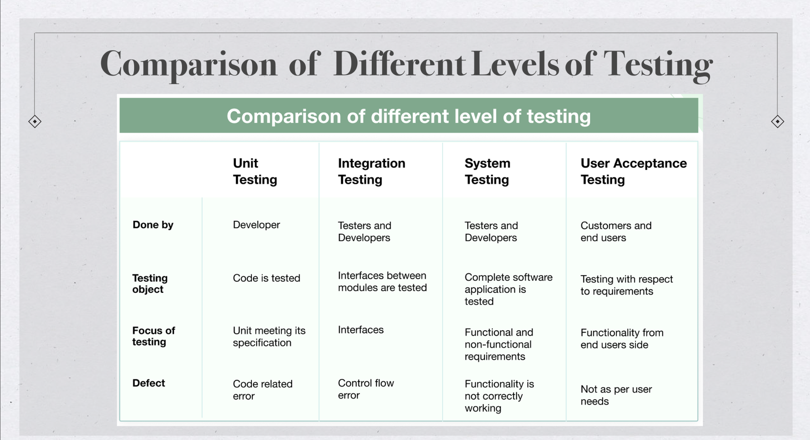

Create time: 2023-02-24  Last update: 2023-02-27

# How to use the FIT study Note document
1. download the [markdown file repository](https://github.com/GreenH47/mynote) and  navigate to the `docs` folder
2. view all the markdown files via [Obsidian vault](https://help.obsidian.md/How+to/Working+with+multiple+vaults) that can show the linked section in the note document    
3. You may find some extra material or program template  repository in the Course Brief introduction for the FIT Note markdown Document (some course don't have )

4. you can view [the web page](https://greenh47.github.io/mynote/) which transfer from MD file online but will lose the extra information or wrong    markdown display

  
# FIT5171 System validation and verification, quality and standards Course Brief introduction

## course outline
| week | Introduction                                        |
| ---- | --------------------------------------------------- |
| 1    | Overview of unit & Fundamentals of software testing |
| 2    | Test Planning & Test-driven development             |
| 3    | Discrete mathematics refresher                      |
| 4    | Black box / functional testing                      |
| 5    | White box / structural testing                      |
| 6    | Component testing                                   |
| 7    | Software quality & metrics                          |
| 8    | System testing                                      |
| 9    | Object-oriented testing                             |
| 10   | Software verification and validation techniques     |
| 11   | Revisiting the fundamentals of testing              |

[FIT5171 - System validation and verification, quality and standards - Monash University](https://handbook.monash.edu/2023/units/FIT5171?year=2023) done for the year 2023. (Semester 1)   

## What do you need to know before hand?
A solid foundation in software development  
Software Requirements Specification (SRS)  
Software development (Java)  
Software Development Life Cycle (SDLS)  
A good command of discrete mathematics concepts  
This unit covers the core software engineering disciplines concerned with managing and delivering quality software. Topics include processes, tools and techniques for system validation and verification, including major commercial tools used in industry. It shows how to detect, analyse and control defects in complex software systems. Inspection and testing methodologies, analysis of artefacts, robustness, quality assurance, and advanced software validation and verification methods are covered.

## Learning outcomes
1. Explain the importance of quality assurance in software engineering;  
2. Articulate the role of validation and verification methods in the system development life cycle; key issues in software testing, testing levels and testing techniques;  
3. Categorise and apply selection and combination of techniques and test related measures;  
4. Measure, evaluate and analyse software under test using different quality and complexity metrics;  
5. Develop adequate test cases to help detect software system defects using industry-strength IDEs, unit testing frameworks such as JUnit, code coverage tools such as Cobertura, and other similar products;  
6. Implement continuous integration (CI) at unit, integration & system testing level using a CI server such as Jenkins to automatically run regression test suites on the system under test.


# week 1 Why testing & Objectives of this unit
##   Learning Objectives:

-   explain the importance of quality assurance in software engineering;
-   articulate the role of validation and verification methods in the system development life cycle; key issues in software testing, testing levels and testing techniques
##   lecture
### Goals of Software testing  
Functionality: software functions correctly  
Usability: ease of use  
Security: free from vulnerabilities and prevent exploits  
Reliability: frequency & criticality of failures (MTBF)  
Efficiency: speed, scalability  
Maintainability: update, modify the application if required  
Portability: compatibility with other environments/systems  
### Test-driven Development (TDD)

+ Test-driven development is a software development process relying on software requirements being converted to test cases before software is fully developed, and tracking all software development by repeatedly testing the software against all test cases.  
+ A Test case is a singular set of actions or instructions to perform that validates a specific aspect of a product or application functionality.
###  black box testing

### white box testing

### comparison of different level of testing

## tutorial 
  
```java
//pom.xml 
<?xml version="1.0" encoding="UTF-8"?>
<project xmlns="http://maven.apache.org/POM/4.0.0"
         xmlns:xsi="http://www.w3.org/2001/XMLSchema-instance"
         xsi:schemaLocation="http://maven.apache.org/POM/4.0.0 http://maven.apache.org/xsd/maven-4.0.0.xsd">
    <modelVersion>4.0.0</modelVersion>

    <groupId>io.javabrains</groupId>
    <artifactId>junit-5-basics</artifactId>
    <version>1.0-SNAPSHOT</version>

// maven properties
    <properties>
	    // level of java
        <maven.compiler.source>8</maven.compiler.source>
        // comile level of java
        <maven.compiler.target>8</maven.compiler.target>
        <project.build.sourceEncoding>UTF-8</project.build.sourceEncoding>
        // junit.jupiter.version and the reference of junit.jupiter dependencies
        <junit.jupiter.version>5.4.0</junit.jupiter.version>
    </properties>

    <dependencies>
	    // junit-jupiter-engine core platform runing the test
        <dependency>
            <groupId>org.junit.jupiter</groupId>
            <artifactId>junit-jupiter-engine</artifactId>
            <version>${junit.jupiter.version}</version>
            // where to active your library
            <scope>test</scope>
        </dependency>
	    //junit-jupiter-api where you using
        <dependency>
            <groupId>org.junit.jupiter</groupId>
            <artifactId>junit-jupiter-api</artifactId>
            <version>${junit.jupiter.version}</version>
            <scope>test</scope>
        </dependency>
    </dependencies>

</project>
```

