Create time: 2023-02-24  Last update: 2023-02-27

# How to use the FIT study Note document
1. download the [markdown file repository](https://github.com/GreenH47/mynote) and  navigate to the `docs` folder
2. view all the markdown files via [Obsidian vault](https://help.obsidian.md/How+to/Working+with+multiple+vaults) that can show the linked section in the note document    
3. You may find some extra material or program template  repository in the Course Brief introduction for the FIT Note markdown Document (some course don't have )

4. you can view [the web page](https://greenh47.github.io/mynote/) which transfer from MD file online but will lose the extra information or wrong    markdown display

  
# FIT5171 System validation and verification, quality and standards Course Brief introduction

## course outline
| week | Introduction                                        |
| ---- | --------------------------------------------------- |
| 1    | Overview of unit & Fundamentals of software testing |
| 2    | Test Planning & Test-driven development             |
| 3    | Discrete mathematics refresher                      |
| 4    | Black box / functional testing                      |
| 5    | White box / structural testing                      |
| 6    | Component testing                                   |
| 7    | Software quality & metrics                          |
| 8    | System testing                                      |
| 9    | Object-oriented testing                             |
| 10   | Software verification and validation techniques     |
| 11   | Revisiting the fundamentals of testing              |

[FIT5171 - System validation and verification, quality and standards - Monash University](https://handbook.monash.edu/2023/units/FIT5171?year=2023) done for the year 2023. (Semester 1)   

## What do you need to know before hand?
A solid foundation in software development  
Software Requirements Specification (SRS)  
Software development (Java)  
Software Development Life Cycle (SDLS)  
A good command of discrete mathematics concepts  
This unit covers the core software engineering disciplines concerned with managing and delivering quality software. Topics include processes, tools and techniques for system validation and verification, including major commercial tools used in industry. It shows how to detect, analyse and control defects in complex software systems. Inspection and testing methodologies, analysis of artefacts, robustness, quality assurance, and advanced software validation and verification methods are covered.

## Learning outcomes
1. Explain the importance of quality assurance in software engineering;  
2. Articulate the role of validation and verification methods in the system development life cycle; key issues in software testing, testing levels and testing techniques;  
3. Categorise and apply selection and combination of techniques and test related measures;  
4. Measure, evaluate and analyse software under test using different quality and complexity metrics;  
5. Develop adequate test cases to help detect software system defects using industry-strength IDEs, unit testing frameworks such as JUnit, code coverage tools such as Cobertura, and other similar products;  
6. Implement continuous integration (CI) at unit, integration & system testing level using a CI server such as Jenkins to automatically run regression test suites on the system under test.


# week 1 Why testing & Objectives of this unit
##   Learning Objectives:

-   explain the importance of quality assurance in software engineering;
-   articulate the role of validation and verification methods in the system development life cycle; key issues in software testing, testing levels and testing techniques
##   lecture
### Goals of Software testing  
Functionality: software functions correctly  
Usability: ease of use  
Security: free from vulnerabilities and prevent exploits  
Reliability: frequency & criticality of failures (MTBF)  
Efficiency: speed, scalability  
Maintainability: update, modify the application if required  
Portability: compatibility with other environments/systems  
### Test-driven Development (TDD)

+ Test-driven development is a software development process relying on software requirements being converted to test cases before software is fully developed, and tracking all software development by repeatedly testing the software against all test cases.  
+ A Test case is a singular set of actions or instructions to perform that validates a specific aspect of a product or application functionality.

#### TDD visualised
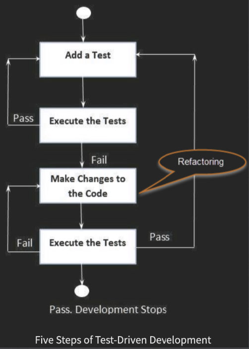  
1. Add a test (!)  
2. Run all tests, and confirm that the new test fails (!)  
3. Write/refine production code to cause the test to pass  
4. Run all tests again  
5. Refactor code if necessary  
6. Repeat
#### TDD: pros & cons
Advantage:  
+ More tests, less debugging  
+ More productive  
+ Validates not only code, but also  design  
+ Better test coverage, greater  confidence  
+ Better code structure

Disadvantage:  
+ difficult in certain scenarios  UI, database, network  
+ Needs management support  
+ Developer blind spots  
+ false sense of security  
+ Maintenance overhead for (bad) tests

###  black box testing
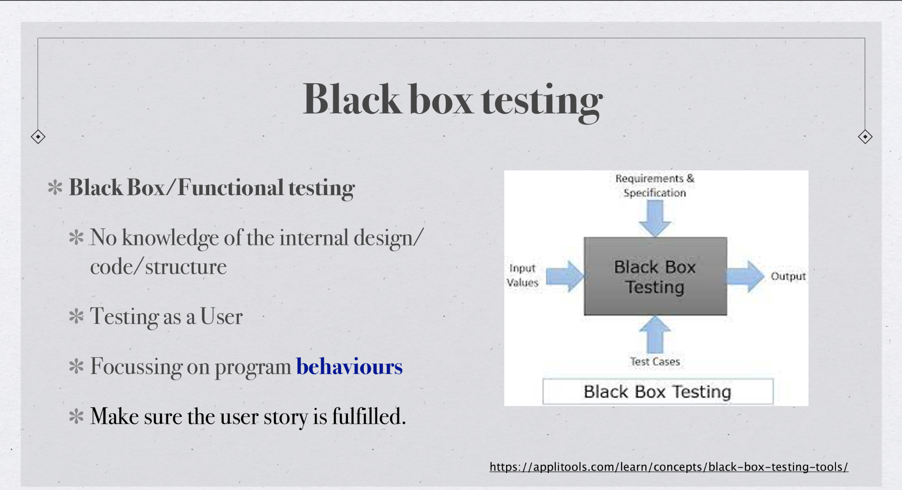
### white box testing
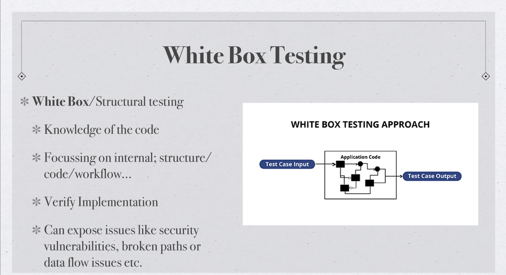
### comparison of different level of testing

## tutorial 
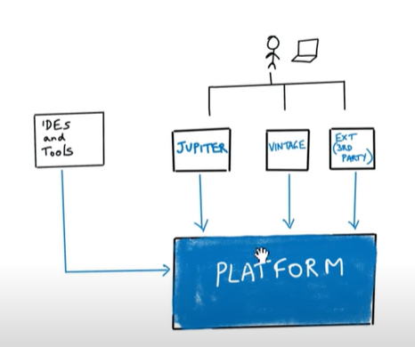  
```java
//pom.xml 
<?xml version="1.0" encoding="UTF-8"?>
<project xmlns="http://maven.apache.org/POM/4.0.0"
         xmlns:xsi="http://www.w3.org/2001/XMLSchema-instance"
         xsi:schemaLocation="http://maven.apache.org/POM/4.0.0 http://maven.apache.org/xsd/maven-4.0.0.xsd">
    <modelVersion>4.0.0</modelVersion>

    <groupId>io.javabrains</groupId>
    <artifactId>junit-5-basics</artifactId>
    <version>1.0-SNAPSHOT</version>

// maven properties
    <properties>
	    // level of java
        <maven.compiler.source>8</maven.compiler.source>
        // comile level of java
        <maven.compiler.target>8</maven.compiler.target>
        <project.build.sourceEncoding>UTF-8</project.build.sourceEncoding>
        // junit.jupiter.version and the reference of junit.jupiter dependencies
        <junit.jupiter.version>5.4.0</junit.jupiter.version>
    </properties>

    <dependencies>
	    // junit-jupiter-engine core platform runing the test
        <dependency>
            <groupId>org.junit.jupiter</groupId>
            <artifactId>junit-jupiter-engine</artifactId>
            <version>${junit.jupiter.version}</version>
            // where to active your library
            <scope>test</scope>
        </dependency>
	    //junit-jupiter-api where you using
        <dependency>
            <groupId>org.junit.jupiter</groupId>
            <artifactId>junit-jupiter-api</artifactId>
            <version>${junit.jupiter.version}</version>
            <scope>test</scope>
        </dependency>
    </dependencies>

</project>
```

### 2.1 Application: anagram detector
> An anagram of a word is another word produced by rearranging the letters of the original word, using all the original letters exactly once.6 For example, “listen” is an anagram of “silent”.   
> This application will need to include the following functionality.   
> 1. Given two words as input, return whether they are anagrams of each other. For example, for “listen” and “silent”, the detector should return true. For “pizza” and “donut”, the detector should return false.
2. Given a list of words separated by whitespace characters, return all the groups of words that are anagrams of each other. For example, assume that the detector is given the following text as input. `tews tis lives tamed elvis ream evils comics stew wets markers dashed west veils rat mace sit mated cosmic mare remarks shaded`  Given the above input, the detector will find the following groups of anagrams as output: `• tis sit
• tamed mated
• comics cosmic
• mare ream
• markers remarks
• dashed shaded
• west wets tews stew
• lives veils elvis evils
• rat
• mace`
> Note that the last two groups in the output represent the two words that do not have anagrams in the input

```java
import java.util.*;  
  
public class AnagramDetector {  
    // This is the main method of the program  
    public static void main(String[] args) {  
        // Create a scanner object to read user input from the console  
        Scanner input = new Scanner(System.in);  
        // Prompt the user to enter words separated by spaces  
        System.out.println("Enter words separated by spaces:");  
        // Read the user input as a single string  
        String words = input.nextLine();  
        // Split the string into an array of words  
        String[] wordsArray = words.split(" ");  
  
        // Call the getAnagramGroups method to group the words by anagrams  
        List<List<String>> anagramGroups = getAnagramGroups(wordsArray);  
  
        // Loop through each group of anagrams  
        for (List<String> group : anagramGroups) {  
            // Create a StringBuilder object to construct a string of words in the current group  
            StringBuilder sb = new StringBuilder();  
            // Loop through each word in the current group  
            for (String word : group) {  
                // Append the current word and a space to the StringBuilder object  
                sb.append(word).append(" ");  
            }  
            // Convert the StringBuilder object to a string and remove any extra spaces at the end  
            String result = sb.toString().trim();  
            // Print the string of words in the current group  
            System.out.println(result);  
        }  
    }  
  
    // This method takes an array of words and groups them by anagrams  
    public static List<List<String>> getAnagramGroups(String[] words) {  
        // Create a list to hold the groups of anagrams  
        List<List<String>> anagramGroups = new ArrayList<>();  
        // Create a map to hold each anagram and its corresponding group  
        Map<String, List<String>> anagramMap = new HashMap<>();  
  
        // Loop through each word in the input array  
        for (String word : words) {  
            // Convert the current word to a char array and sort it  
            char[] chars = word.toCharArray();  
            Arrays.sort(chars);  
            // Convert the sorted char array back to a string  
            String sortedWord = new String(chars);  
  
            // Check if the anagramMap already contains the current sorted word  
            if (anagramMap.containsKey(sortedWord)) {  
                // If it does, add the current word to the corresponding group  
                anagramMap.get(sortedWord).add(word);  
            } else {  
                // If it doesn't, create a new group for the current word  
                List<String> group = new ArrayList<>();  
                group.add(word);  
                // Add the new group to the anagramGroups list  
                anagramGroups.add(group);  
                // Add the current sorted word and its corresponding group to the anagramMap  
                anagramMap.put(sortedWord, group);  
            }  
        }  
  
        // Return the list of groups of anagrams  
        return anagramGroups;  
    }  
}
```
### TDD(Test-Driven Development) for 2.1
> Making use of the TDD process, write some tests for the above functionality and use them to guide you in writing the actual code that actually implements the functionality. You should do this iteratively
####  Iteration 1 
```java
@Test  
 /*  
check that the getAnagramGroups method returns an  
empty list when passed an empty array of words.  
*/  
void getAnagramGroupsEmptyList() {  
    String[] words = {};  
    List<List<String>> result = AnagramDetector.getAnagramGroups(words);  
    assertTrue(result.isEmpty());  
}
```
it return true so no need to modify
#### Iteration 2
```java
@Test  
    /*  
    * check that the getAnagramGroups method correctly groups    * a set of words that are all anagrams of each other    * */void getAnagramGroupsSameGroup() {  
    String[] words = {"listen", "silent", "enlist"};  
    List<List<String>> result = AnagramDetector.getAnagramGroups(words);  
    assertEquals(1, result.size());  
    assertTrue(result.get(0).contains("listen"));  
    assertTrue(result.get(0).contains("silent"));  
    assertTrue(result.get(0).contains("enlist"));  
}
```
it return true so no need to modify
####  Iteration 3
```java 
@Test  
public void testGetAnagramGroups() {  
    // Test case with no input  
    String[] emptyWordsArray = {};  
    assertTrue(AnagramDetector.getAnagramGroups(emptyWordsArray).isEmpty());  
  
    // Test case with single word input  
    String[] singleWordArray = {"hello"};  
    assertEquals(1, AnagramDetector.getAnagramGroups(singleWordArray).size());  
  
    // Test case with input containing only anagrams  
    String[] anagramWordsArray = {"race", "care", "acre"};  
    assertEquals(1, AnagramDetector.getAnagramGroups(anagramWordsArray).size());  
  
    // Test case with input containing no anagrams  
    String[] nonAnagramWordsArray = {"hello", "world", "java"};  
    assertEquals(3, AnagramDetector.getAnagramGroups(nonAnagramWordsArray).size());  
  
    // Test case with input containing multiple anagram groups  
    String[] multipleGroupsWordsArray = {"race", "care", "acre", "listen", "silent", "enlist"};  
    assertEquals(2, AnagramDetector.getAnagramGroups(multipleGroupsWordsArray).size());  
  
    
}
```
it all return true so no need to modify
#### Iteration 4
```java
@Test  
/*  
* This test case ensures that the getAnagramGroups method correctly  
* groups anagrams even when the input array contains duplicates  
* */  
public void testGetAnagramGroups_InputWithDuplicates_ReturnsAnagramGroups() {  
    AnagramDetector detector = new AnagramDetector();  
    List<List<String>> result = detector.getAnagramGroups(new String[]{"eat", "tea", "ate", "ape", "pea", "pea", "are"});  
    assertEquals(3, result.size());  
    assertTrue(result.contains(Arrays.asList("eat", "tea", "ate")));  
    assertTrue(result.contains(Arrays.asList("ape", "pea", "pea")));  
    assertTrue(result.contains(Collections.singletonList("are")));  
    assertFalse(result.contains(Arrays.asList("tea", "ate", "eat", "pea", "ape", "pea", "are")));  
}
```

### 2.2 k-th largest element of an array
>  write  a java program k-th largest element of an array user input an array sperate by , first and then input an int k, find the k-th largest element in this array.   
>  IF given an array -1, 0, 2, 6, 4 and  3, you are required to find the 3rd largest element of the array, which is 2
```java
import java.util.Arrays;  
import java.util.Scanner;  
  
public class KthLargestElement {  
  
    public static void main(String[] args) {  
        // Read input array from user  
        Scanner scanner = new Scanner(System.in);  
        System.out.print("Enter the array elements separated by comma: ");  
        String input = scanner.nextLine();  
        String[] values = input.split(",");  
        int[] arr = new int[values.length];  
        for (int i = 0; i < values.length; i++) {  
            arr[i] = Integer.parseInt(values[i].trim());  
        }  
  
        // Read the value of k from user  
        System.out.print("Enter the value of k: ");  
        int k = scanner.nextInt();  
  
        // Find the k-th largest element using findKthLargestElement()  
        int kthLargest = findKthLargestElement(arr, k);  
  
        // Print the k-th largest element  
        System.out.println("The " + k + "-th largest element is " + kthLargest);  
    }  
  
    public static int findKthLargestElement(int[] arr, int k) {  
      
	// If k is greater than the length of the array, return -1  
	if (k > arr.length) {  
	    return -1;  
	}  
	  
	// Sort the array in descending order  
	Arrays.sort(arr);  
	int x = arr.length - k;  
	int kthLargest = arr[x];  
	return kthLargest;
	}
}

```
terminal window  
```
Enter the array elements separated by comma: -1, 0, 2, 6, 4
Enter the value of k: 3
The 3-th largest element is 2

```

so we will test findKthLargestElement() method and make iteration
```java 
public static int findKthLargestElement(int[] arr, int k) {  
      
	// If k is greater than the length of the array, return -1  
	if (k > arr.length) {  
	    return -1;  
	}  
	  
	// Sort the array in descending order  
	Arrays.sort(arr);  
	int x = arr.length - k;  
	int kthLargest = arr[x];  
	return kthLargest;
}
```
#### Iteration 1: Simple Test Case
```java
@Test  
/*  
* an array with only one element, and we want to  
* find the 1st largest element. We expect the output to be the same element.  
* */  
public void testKthLargestElement() {  
    int[] arr = {3};  
    int k = 1;  
    int expected = 3;  
    int actual = KthLargestElement.findKthLargestElement(arr, k);  
    assertEquals(expected, actual);  
}  
  
@Test  
/*  
*  array of multiple elements. We want to find the 3rd largest element of the array.  
* */  
public void testKthLargestElementMulti() {  
    // Test Case 1  
    int[] arr1 = {3};  
    int k1 = 1;  
    int expected1 = 3;  
    int actual1 = KthLargestElement.findKthLargestElement(arr1, k1);  
    assertEquals(expected1, actual1);  
  
    // Test Case 2  
    int[] arr2 = {5, 3, 9, 8, 1};  
    int k2 = 3;  
    int expected2 = 5;  
    int actual2 = KthLargestElement.findKthLargestElement(arr2, k2);  
    assertEquals(expected2, actual2);  
}
```

#### Iteration : Edge Cases
```java
import org.junit.Test;
import static org.junit.Assert.assertEquals;

public class KthLargestElementTest {

    @Test
    public void testKthLargestElement() {
        // Test Case 1
        int[] arr1 = {3};
        int k1 = 1;
        int expected1 = 3;
        int actual1 = KthLargestElement.findKthLargestElement(arr1, k1);
        assertEquals(expected1, actual1);

        // Test Case 2
        int[] arr2 = {5, 3, 9, 8, 1};
        int k2 = 3;
        int expected2 = 5;
        int actual2 = KthLargestElement.findKthLargestElement(arr2, k2);
        assertEquals(expected2, actual2);

        // Test Case 3
        int[] arr3 = {3, 3, 5, 2, 5, 2};
        int k3 = 2;
        int expected3 = 5;
        int actual3 = KthLargestElement.findKthLargestElement(arr3, k3);
        assertEquals(expected3, actual3);

        // Test Case 4
        int[] arr4 = {5, 3, 9, 8, 1};
        int k4 = 10;
        int expected4 = -1;
        int actual4 = KthLargestElement.findKthLargestElement(arr4, k4);
        assertEquals(expected4, actual4);

        // Test Case 5
        int[] arr5 = {};
        int k5 = 1;
        int expected5 = -1;
        int actual5 = KthLargestElement.findKthLargestElement(arr5, k5);
        assertEquals(expected5, actual5);
    }
}

```
all pass

# Week 2 Test-driven Development/ Unit testing / Test Planning
## Learning Objectives
-   articulate the advantages and disadvantages of <mark style="background: #0000CD;">Test-Driven Development (TDD)</mark>  
-   know the benefits of unit testing; develop unit test cases using industry-strength IDES, and unit testing frameworks such as JUnit.   
-   demonstrate the basic elements of <mark style="background: #ff0000;">test strategy and test planning</mark>;
## Lecture
### Unit testing
Unit: a very small abstraction of a class/object that performs some operations  
Unit testing: testing units  Individually, in isolation, separately, not together, one at a time  
#### Junit basics
+ JUnit tests are also called test methods in a test class
+ Naming convention of test classes: name of class under  test + Test `ShoppingCartTest.java for  ShoppingCart.java`  
+ Test names should be meaningful and reflect purpose `shouldReturnTrueWhenUsersHaveSameEmail()`
#### Test Annotations
[JUnit 5 User Guide](https://junit.org/junit5/docs/current/user-guide/#writing-tests-annotations)  
`@Before Each, @After Each` :  
initialise the user every time before  running the test case for a particular user  
```java
private User target;  
@BeforeEach  
public void setUp() {  
	target = new User();  
}
```
`@Timeout(value=1000, unit =  TimeUnit.MILLISECONDS)` : timeout  
in 1,000 milliseconds  
`@ParameterisedTest` : Claim this  
methods has input parameter  
```java
@ParameterizedTest 
@ValueSource(ints = {1, 3, 5, -3, 15, Integer.MAX_VALUE}) // six numbers 
void isOdd_ShouldReturnTrueForOddNumbers(int number) { 
	assertTrue(Numbers.isOdd(number)); 
}
```
#### Test Assertions
Assertions allow us to compare  expected vs actual behaviours (output  values, exceptions, etc.)  
```java
assertTrue() assertFalse()  
assertEquals() assertNotEquals()  
assertNull() assertNotNull()  
assertSame() assertNotSame()  
assertArrayEquals() assertThrows()  
```

### Test plan
[Sample System Integration Test Plan - XYZ Remote Office Payroll System ](https://www.practitest.com/assets/pdf/system-integration-testing-template.pdf)

## Tutorial
You will create  add method for each requirement incrementally. You will be develop the requirements using TDD.
### Quiz
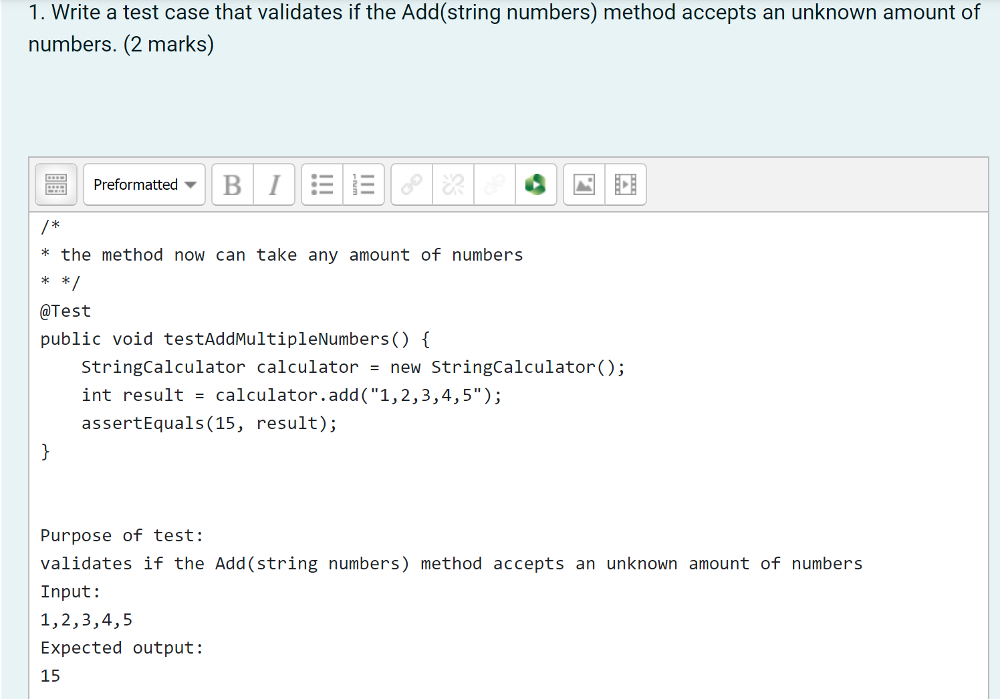

### Iteration 1
The method can take up to 2 numbers, and will return their sum (for an empty string it will return 0)  for example “” or “1” or “1,2” 
```java
@Test
public void testAddMethodWithEmptyString() {
    StringCalculator calculator = new StringCalculator();
    int result = calculator.add("");
    assertEquals(0, result);
}

```  

```java
public class StringCalculator {
    public int add(String numbers) {
        if (numbers.isEmpty()) {
            return 0;
        }
        return -1; // Placeholder return value for now
    }
}
```
### iteration 2
the method now can take any amount of numbers
```java
@Test
public void testAddMethodWithMultipleNumbers() {
    StringCalculator calculator = new StringCalculator();
    int result = calculator.add("1,2,3,4,5");
    assertEquals(15, result);
}
```  

```java
// Calculate the sum of the numbers  
int sum = 0;  
for (String token : tokens) {  
    // Convert each token to an integer and add it to the sum  
    sum += Integer.parseInt(token);  
}

```
### iteration 3
allow the Add method to handle new lines between numbers (instead of commas). The following input is ok: “1\n2,3” (will equal 6)  
```java
@Test
public void testAddMethodWithNewLinesBetweenNumbers() {
    StringCalculator calculator = new StringCalculator();
    int result = calculator.add("1\n2,3");
    assertEquals(6, result);
}

```

```java
String[] tokens = numbers.split("[,\n]");
```
### iteration 4
```java
/*  
* Support different delimiters, the beginning of the string  
* will contain a separate line that looks like this:“//delimiter\n[numbers. . . ]”  
* for example “//;\n1;2” should return three where the delimiter is ‘;’  
* item The first line is optional. All existing scenarios should still be supported  
* */  
@Test  
public void testAddMethodWithCustomDelimiter() {  
    StringCalculator calculator = new StringCalculator();  
    int result = calculator.add("//;\n1;2");  
    assertEquals(3, result);  
}
```  
split the input string `numbers` using a regular expression that matches either commas or new lines as a delimiter, using the pattern `[,\n]`. This allows  handle both commas and new lines as separators between the numbers
```java
// Default delimiter is comma or new line 
String delimiter = "[,\n]"; 
// Check if the input string specifies a custom delimiter 
if (numbers.startsWith("//")) { 
// Extract the delimiter and the numbers 
	int delimiterEndIndex = numbers.indexOf("\n"); 
	delimiter = numbers.substring(2, delimiterEndIndex); 
	numbers = numbers.substring(delimiterEndIndex + 1); 
} 
// Split the input string using the specified delimiter 
String[] tokens = numbers.split(delimiter); 
// Calculate the sum of the numbers 
int sum = 0;
```

### Iteration 5
```java
/*  
* Calling add with a negative number will throw an exception  
* “negatives not allowed” – and prints the negative number that was passed.  
* If there are multiple negatives, show all of them in the exception message  
* */  
@Test  
public void testAddMethodWithNegativeNumbers() {  
    StringCalculator calculator = new StringCalculator();  
    try {  
        int result = calculator.add("1,-2,3,-4");  
        fail("Exception should have been thrown");  
    } catch (IllegalArgumentException e) {  
        assertEquals("Negatives not allowed: -2, -4", e.getMessage());  
    }  
}
```  

```java
// Calculate the sum of the numbers  
int sum = 0;  
List<Integer> negatives = new ArrayList<>();  
for (String token : tokens) {  
    // Convert each token to an integer and add it to the sum  
    int number = Integer.parseInt(token);  
    if (number < 0) {  
        negatives.add(number);  
    }  
    sum += number;  
}  
  
// If there are negative numbers, throw an exception  
if (!negatives.isEmpty()) {  
    StringBuilder sb = new StringBuilder("Negatives not allowed: ");  
    for (int i = 0; i < negatives.size(); i++) {  
        sb.append(negatives.get(i));  
        if (i < negatives.size() - 1) {  
            sb.append(", ");  
        }  
    }  
    throw new IllegalArgumentException(sb.toString());  
}
```

### iteration 6
```java
/*  
* Numbers bigger than 1000 should be ignored, so adding 2 + 1001 = 2  
* */  
@Test  
public void testAddMethodWithNumbersGreaterThan1000() {  
    StringCalculator calculator = new StringCalculator();  
    int result = calculator.add("2,1000,1001");  
    assertEquals(1002, result);  
}
```

```java
// Calculate the sum of the numbers, ignoring numbers greater than or equal to 1000 
int sum = 0; 
List<Integer> negatives = new ArrayList<>(); 
for (String token : tokens) { 
	// Convert each token to an integer and add it to the sum 
	int number = Integer.parseInt(token); 
	if (number < 0) { 
		negatives.add(number); 
	} 
	else if (number <= 1000) { 
		sum += number; 
	} 
}
```

### Iteration 7
```java
/*  
* Delimiters can be of any length with the following format:  
* “//[delimiter]\n” for example: “//[—]\n1—2—3” should return 6  
* */  
@Test  
public void testAddMethodWithLongDelimiter() {  
    StringCalculator calculator = new StringCalculator();  
    int result = calculator.add("//[***]\n1***2***3");  
    assertEquals(6, result);  
}
```

handle long delimiters by checking if the delimiter starts and ends with square brackets, and removing them if so. Also use the `Pattern.quote` method to escape any special characters in the delimiter before using it to split the input string.
```java
// Check if the input string specifies a custom delimiter  
if (numbers.startsWith("//")) {  
    // Extract the delimiter and the numbers  
    int delimiterEndIndex = numbers.indexOf("\n");  
    delimiter = numbers.substring(2, delimiterEndIndex);  
    // Handle long delimiters  
    if (delimiter.startsWith("[") && delimiter.endsWith("]")) {  
        delimiter = delimiter.substring(1, delimiter.length() - 1);  
    }  
    numbers = numbers.substring(delimiterEndIndex + 1);  
}  
  
// Split the input string using the specified delimiter  
String[] tokens = numbers.split(Pattern.quote(delimiter));
```
### iteration 8 
```java
/*  
* Allow multiple delimiters like this: “//[delimitor1][delimitor2]\n”  
* for example “//[-][;]\n1-2;3” should return 6  
* */  
@Test  
public void testAddMethodWithMultipleDelimiters() {  
    StringCalculator calculator = new StringCalculator();  
    int result = calculator.add("//[-][;]\n1-2;3");  
    assertEquals(6, result);  
}
```  
update the `add` method to handle this case by modifying the regular expression used to split the input string. extract the delimiter(s) from the input string and use the `|` character to indicate alternate delimiters in the regular expression used to split the input string. The delimiter(s) can be specified in the input string using the format `//[delimiter]\n` (for a single delimiter) or `//[delimiter1][delimiter2]...\n` (for multiple delimiters).
```java
// Check if the input string has a custom delimiter  
String delimiterRegex = "[,\n]";  
if (numbers.startsWith("//")) {  
    int delimiterStartIndex = 2;  
    int delimiterEndIndex = numbers.indexOf("\n");  
    String delimiterLine = numbers.substring(delimiterStartIndex, delimiterEndIndex);  
    // Split the delimiter line by "][" to handle multiple delimiters  
    String[] delimiters = delimiterLine.split("\\]\\[");  
    for (String delimiter : delimiters) {  
        // Remove the square brackets from each delimiter  
        delimiter = delimiter.replace("[", "").replace("]", "");  
        // Add each delimiter to the regular expression  
        delimiterRegex += "|" + Pattern.quote(delimiter);  
    }  
    // Remove the delimiter line from the input string  
    numbers = numbers.substring(delimiterEndIndex + 1);  
}  
  
// Split the input string using the delimiter(s)  
String[] tokens = numbers.split(delimiterRegex);
```

### Iteration 9 IDK 
```java
/*  
* Make sure you can also handle multiple delimiters with  
* length longer than one char  
* */  
@Test  
public void Q9AddMultipleDelimiters() {  
    StringCalculator calculator = new StringCalculator();  
    int result = calculator.add("//[---][%$]\n1--;2$3");  
    assertEquals(6, result);  
}
```

# Week 3 Discrete maths
## Lecture
[Glossary of mathematical symbols - Wikipedia](https://en.wikipedia.org/wiki/Glossary_of_mathematical_symbols)  
[Directed and Undirected graph in Discrete Mathematics](https://www.javatpoint.com/directed-and-undirected-graph-in-discrete-mathematics)
Logic  
Basic set theory  
Relations & functions  
Basic graph theory
### Propositional logic 命题逻辑
Propositional logic is the logic that deals with a collection of declarative statements which have a truth value,  <mark style="background: #0000CD;">true or false</mark>.  
Proposition symbols:  `penguines_black_white`  
logical operators : Logic not (¬), and (⋀), or (⋁), implies意味着  (⇒) & equivalent (⇔)  
公理和推理规则 `¬ ¬p⊢p, {p, p ⇒q}⊢q`  


Predicate logic is an expression consisting of variables with a specified domain. It consists of objects, relations,  formulas and/or functions between the objects 谓词逻辑是由具有指定域的变量组成的表达式。它由对象、对象之间的关系、公式和/或函数组成
+ Universal (∀) & existential (∃)  
+ ∀x . P(x) => ∀ logician . wants_beer(logician)  

#### First-order logic  
+ Quantifies over arguments only  
+ Exist a person who is both a student and a tutor in  FIT.  
+ ∃x (P(x) ⋀ Q(x)

### Basic set definitions
Definition: a collection of elements  No ordering, no multiplicity 定义：元素的集合没有顺序，没有多重性
+ Enumeration: {1,2,3,4}  
+ Set comprehension: ${x : N | x ≤ 64}$  
+ A special set - the empty set ∅  

### Set membership & inclusion
+ Membership: $x∈{x}, x ∉ ∅$
+ Subset子集：: $A ⊆ B ⇔ ∀ x : A • x ∈ B$
+ Proper subset 
+ Set cardinality 设置基数 `#A | A |` `#A = 3`

#### Power set P
A power set is set of all subsets, empty set and the original set itself 幂集是所有子集、空集和原始集本身的集合   
+ $∀X • X$   is a set, $Px = {A|A ⊆ X}$  
+ power set of A = {1, 2} is P(A) = {{}, {1}, {2}, {1, 2}}
#### Set operations
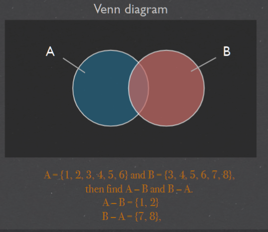
+ Union : $A 𝕌 B$  The set containing all the elements of  which all other sets are subs
+ Intersection : $A∩B$  Items common in A,B
+ Difference : $A\B$ 
+ Cartesian product笛卡尔积 : `{a, b} X {0, 1} = {(a, 0), (a, 1), (b, 0), (b, 1)}`
### Relations ( ⇔) & functions (→ )  
#### Relations ( ⇔)
Relations (R) are defined over sets  A relation is a collection of ordered pairs, which  contains an object from one set to the other set 关系 (R) 是在集合上定义的 关系是有序对的集合，其中包含从一个集合到另一个集合的对象 Can be one-to-one, one-to-many  or many-to-one, many-to-many  
The Cartesian product deals with ordered pairs, so  the order in which the sets are considered is 笛卡尔积处理有序对，因此考虑集合的顺序是  `friends : Person ⇔ Person`  
$X х Y = {(x, y)} | x ∈ X and y ∈ Y} Where X х Y ≠ Y х X$  
Using n(A) for the number of elements in a set A, we have $n(X х Y) = n(X) х n(Y)$ 
#### functions (→ )
It is a relation that defines the set of  inputs to the set of outputs.  Note that all functions are relations, but  not all relations are functions 它是定义输入集到输出集的关系。请注意，所有函数都是关系，但并非所有关系都是函数  
`→ `  implies/ when used in functions, it  symbolises mapping A→B, if A is true then B is also true.  If A is false then nothing said about  B  
`age : Person N`  `birthday : Person → Date`
### Graph theory
#### Undirected graphs 无向图  
[CS Academy](https://csacademy.com/app/graph_editor/)
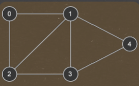
$G = (V, E)$   
+ <mark style="background: #ff0000;">V: a non-empty set of nodes {n1, n2 , n3, ..., nm }</mark>    
+ <mark style="background: #ff0000;">E: a set of edges {e1, e2, ..., ep}, where each ek = (ni, nj)</mark>  
#### Representation & Degree
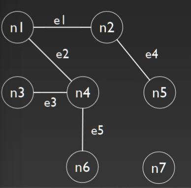
`V = {n 1 , n 2 , n 3 , n 4 , n 5 , n 6 , n 7}`  
`E = {e1 , e2 , e3 , e4 , e 5 , } = {(n 1 , n 2 ), (n 1 , n 4 ), (n 2 , n 5 ), (n 3 , n 4 ), (n 4 , n 6 )}`  
<mark style="background: #0000CD;">Degree of node : No. of edges that have that node as  an endpoint</mark>  
`degree(n 1 ) = 2, degree(n 4 ) = 3,  degree(n 7 ) = 0`  
#### Incidence Matrix
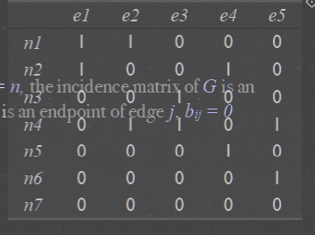
#### Path & Connectedness
Nodes ni and nj are connected if they  are in a path.  A component is a maximal set of  connected node 如果节点 ni 和 nj 在一条路径中，则它们是连通的 分量是连通节点的最大集合 `Path(n1,n5) = (n1, n2, n5) = <e1,  e4>` 
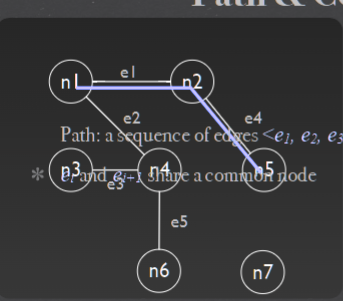
### Directed graphs
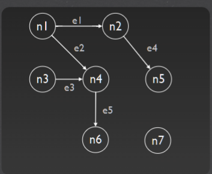
directed graph D = (V, E)  
+ V: a non-empty set of nodes {n1,  n2, n3 , ..., n m } 
+ E: a set of edges {e1, e2, ..., ep}  
where each ek = <ni, nj> an ordered pair
#### Indegrees & outdegrees
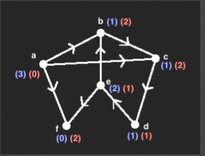
+ Indegree (or fan-in) of a node n is  the<mark style="background: #0000CD;"> no. of distinct edges that have n as  target</mark>. A node with indegree = 0 is called a source node  
+ Outdegree (or fan-out) of a node n  is the<mark style="background: #ff0000;"> no. of distinct edges that have n  as the start node</mark>.  A node with outdegree = 0 is called a  sink node
#### Paths & semi-paths
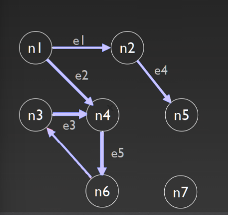

## Tutorial
### Q1
Decide if the following predicates are true. If not, give a counter example   
#### (a) ∀A∃B • C ≡ ∃B∀A • C , where A and B are variable declarations and C is a Boolean expression  
1. check if both sides of the equivalence are logically equivalent  
2. ∀A∃B • C = "For all A, there exists a B such that C is true"  ∀A∃B • C =“对于所有A，存在一个B使得C为真”
3. ∃B∀A • C = "There exists a B such that for all A, C is true"  ∃B∀A • C =“存在一个B使得对于所有A，C为真”
4. find a counterexample  A be the set of integers and B be the set of real numbers. Let C be the Boolean expression "A is a subset of B".
5. ∀A∃B • C = "For all sets of integers A, there exists a set of real numbers B such that A is a subset of B" ∀A∃B • C = “对于所有整数集 A，存在一组实数 B，使得 A 是 B 的子集”This statement is true because we can always choose B to be the set of real numbers, which contains the set of integers. Therefore, C is true for all A.
6. ∃B∀A • C = "There exists a set of real numbers B such that for all sets of integers A, A is a subset of B" ∃B∀A • C = “存在一组实数 B，使得对于所有整数集 A，A 是 B 的子集” 
7. This statement is false because we can choose B to be any non-empty set of real numbers, and there will always exist an integer that is not in B. Therefore, C is false for some A. 这个陈述是错误的，因为我们可以选择 B 是任何非空的实数集，并且总会存在一个不在 B 中的整数。因此，对于某些 A，C 是错误的。
8. conclusion:  ∀A∃B • C is not logically equivalent to ∃B∀A • C
#### (b) ∀A, B : P N • A ⊆ B ∨ B ⊆ A 
∀A, B : P N • A ⊆ B ∨ B ⊆ A can be read as "For all sets A and B of natural numbers, A is a subset of B or B is a subset of A." ∀A, B : P N • A ⊆ B ∨ B ⊆ A 可以理解为“对于自然数的所有集合 A 和 B，A 是 B 的子集或 B 是 A 的子集。”To prove this predicate, we need to show that for any arbitrary sets A and B of natural numbers, either A is a subset of B or B is a subset of A. 为了证明这个谓词，我们需要证明对于任意自然数集合 A 和 B，要么 A 是 B 的子集，要么 B 是 A 的子集。
1. Case 1: A ⊆ B If A is a subset of B, then the predicate is true.  
2. Case 2: B ⊆ A If B is a subset of A, then the predicate is true.
3. Case 3: A ∩ B = ∅ If A and B have no common elements, then either A is a subset of B or B is a subset of A. This is because if there is no element in common between A and B, then either A is entirely contained within B, or B is entirely contained within A. 如果 A 和 B 没有公共元素，则 A 是 B 的子集或 B 是 A 的子集。这是因为如果 A 和 B 之间没有公共元素，则 A 完全包含在 B 中，或者B 完全包含在 A 中。
4. Case 4: A ∩ B ≠ ∅ If A and B have some common elements, then we can define the set C = A ∪ B. Since C is a set of natural numbers, we know that C is a subset of the natural numbers 如果A和B有一些共同的元素，那么我们可以定义集合C = A ∪ B。由于C是自然数的集合，我们知道C是自然数的子集 Moreover, we know that A and B are not disjoint, so A ∩ B ≠ ∅ implies that A and B are not both equal to ∅. 此外，我们知道 A 和 B 不相交，所以 A ∩ B ≠ ∅ 意味着 A 和 B 不都等于 ∅。A and B are not both equal to ∅. Therefore, at least one of A and B is not equal to ∅, which implies that at least one of A and B is not equal to ∅ ∪ ∅ = ∅. A 和 B 不都等于 ∅。因此，A 和 B 中至少有一个不等于 ∅，这意味着 A 和 B 中至少有一个不等于 ∅ ∪ ∅ = ∅。
5. for any arbitrary sets A and B of natural numbers, either A is a subset of B or B is a subset of A. Therefore, the predicate ∀A, B : P N • A ⊆ B ∨ B ⊆ A is true. 对于任意自然数集合 A 和 B，要么 A 是 B 的子集，要么 B 是 A 的子集。因此，谓词∀A, B : P N • A ⊆ B ∨ B ⊆ A 为真。
### Q2
Give a formal definition of the binary relation R, over natural numbers, such that each x is related to y  by R if and only if y is greater than the square of x but less than the square of x + 1. 给出自然数上二元关系 R 的正式定义，使得每个 x 都通过 R 与 y 相关当且仅当 y 大于 x 的平方但小于 x + 1 的平方。For any x, y ∈ N, xRy if and only if y > x^2 and y < (x+1)^2.  
1. simply plug in the values of x and y into the definition of the relation and see if it holds true x=2 and y=9, 9 > 2^2 and 9 < (2+1)^2 True  
2. x=3 and y=8, 8 > 3^2 and 8 < (3+1)^2 False
### Q3
Let S be the set of natural numbers between 1 and 15 inclusively. Express R in Q2 as a set of ordered pairs in S.   设 S 为 1 到 15 之间的自然数集。将 Q2 中的 R 表示为 S 中的一组有序对。For any x, y ∈ N, xRy if and only if y > x^2 and y < (x+1)^2.  R as a set of ordered pairs in S, where S is the set of natural numbers between 1 and 15 inclusively. To do this, we need to list all the pairs (x, y) where x and y are elements of S and xRy holds. R 作为 S 中的一组有序对，其中 S 是 1 到 15 之间的自然数集。为此，我们需要列出所有对 (x, y)，其中 x 和 y 是 S 的元素并且 xRy 成立。
1. the values of x in S: 1, 2, 3, 4, 5, 6, 7, 8, 9, 10, 11, 12, 13, 14, 15  
2. x^2 < y < (x+1)^2 list the ordered pairs (x, y) where xRy holds for each x in S  
3. For x=1, the values of y that satisfy xRy are 2, 3, 4, 5, 6, 7, 8, 9, 10, 11, 12, 13, 14, 15. So the ordered pairs are: `{(1, 2), (1, 3), (1, 4), (1, 5), (1, 6), (1, 7), (1, 8), (1, 9), (1, 10), (1, 11), (1, 12), (1, 13), (1, 14), (1, 15)}`  
4. For x=2, the values of y that satisfy xRy are 5, 6, 7, 8, 9, 10, 11, 12, 13, 14, 15. So the ordered pairs are: `{(2, 5), (2, 6), (2, 7), (2, 8), (2, 9), (2, 10), (2, 11), (2, 12), (2, 13), (2, 14), (2, 15)}`  
5. For x=3, the values of y that satisfy xRy are 10, 11, 12, 13, 14, 15. So the ordered pairs are: `{(3, 10), (3, 11), (3, 12), (3, 13), (3, 14), (3, 15)}`  
6. For x=4, the values of y that satisfy xRy are 17, 18, 19, 20, 21, 22, 23, 24, 25. However, since 25 is greater than 15, we can exclude it from our list of ordered pairs. So the ordered pairs are: `{(4, 17), (4, 18), (4, 19), (4, 20), (4, 21), (4, 22), (4, 23), (4, 24)}`  
7. For x=5, the values of y that satisfy xRy are 26, 27, 28, 29, 30, 31, 32, 33, 34 However, since all of these values are greater than 15, we can exclude them from our list of ordered pairs. So there are no ordered pairs for x=5.
8. For x= 6 ~ 15 is the same reason
9. Therefore, the set of ordered pairs in S that represent the relation R is: `{(1, 2), (1, 3), (1, 4), (1, 5), (1, 6), (1, 7), (1, 8), (1, 9), (1, 10), (1, 11), (1, 12), (1, 13), (1, 14), (1, 15), (2, 5), (2, 6), (2, 7), (2, 8), (2, 9), (2, 10), (2, 11), (2, 12), (2, 13), (2, 14), (2, 15), (3, 8), (3, 9), (3, 10), (3, 11), (3, 12), (3, 13), (3, 14), (3, 15), (4, 13), (4, 14), (4, 15)}`  
### Q4 Graph Theory
Given an undirected graph G with vertices V = {1, 2, 3, 4, 5, 6, 7, 8} and edges E = {12, 14, 16, 22, 23,  28, 34, 35, 67, 78}  
#### (a) Draw G graphically
```
   1 --- 2 --- 3
   |     |     |
   4     8     5
         \
          6 -- 7
```
#### (b) Calculate the degree of each node in the graph
-   count the number of edges incident to each vertex. in an undirected graph, the degree of a node is equal to the number of edges incident to it, because each edge contributes to the degree of both of its endpoints. 计算入射到每个顶点的边数。在无向图中，节点的度数等于入射到它的边的数量，因为每条边都会影响其两个端点的度数。
- degree(1) = 2 (incident edges are 12 and 14)
-   degree(2) = 3 (incident edges are 12, 22, and 28)
-   degree(3) = 2 (incident edges are 23 and 35)
-   degree(4) = 1 (incident edge is 14)
-   degree(5) = 1 (incident edge is 35)
-   degree(6) = 2 (incident edges are 67 and 28)
-   degree(7) = 1 (incident edge is 78)
-   degree(8) = 1 (incident edge is 16)
#### (c) Calculate the Cyclomatic number of G
The cyclomatic number, also known as the connectivity or the circuit rank, is a graph-theoretic measure that gives the minimum number of edges that need to be removed from a graph in order to disconnect it or make it acyclic. 圈数，也称为连通性或电路等级，是一种图论度量，它给出了需要从图中删除的最小边数，以便断开它或使其成为非循环的。 
The formula for the cyclomatic number is: `c = |E| - |V| + k`  where |E| is the number of edges, |V| is the number of vertices, and k is the number of connected components in the graph.其中|E|是边数，|V|是顶点的数量，k 是图中连通分量的数量。
1. `|V| = 8` `|E| = 10 (counting each undirected edge once)` `k = 1 (because the graph is connected)` 
2. `c = |E| - |V| + k = 10 - 8 + 1 = 3` 
### Q5 
Let’s treat G in Q5 as a directed graph (edge 12 in E represents an edge from node 1 to node 2)
#### (a) Draw G graphically
```
   1 --> 2 --> 3
   ↑     ↓     ↓
   4     8     5
   ↓           ↑
   6 --> 7 ----|

```
#### (b) Calculate the in-degree and out-degree of each node (ignoring edge 22 for this question)
in a directed graph, the in-degree of a node is the number of edges coming into it, while the out-degree of a node is the number of edges going out from it. 在有向图中，节点的入度是进入它的边的数量，而节点的出度是从它出去的边的数量。
-   in-degree(1) = 1, out-degree(1) = 1
-   in-degree(2) = 2, out-degree(2) = 1
-   in-degree(3) = 2, out-degree(3) = 0
-   in-degree(4) = 1, out-degree(4) = 1
-   in-degree(5) = 1, out-degree(5) = 1
-   in-degree(6) = 1, out-degree(6) = 1
-   in-degree(7) = 2, out-degree(7) = 0
-   in-degree(8) = 1, out-degree(8) = 1
#### (c) Are there any source nodes or sink nodes in G?
A source node is a node with in-degree 0, meaning there are no incoming edges to that node. A sink node is a node with out-degree 0, meaning there are no outgoing edges from that node.源节点是入度为 0 的节点，这意味着该节点没有传入边。汇节点是出度为 0 的节点，这意味着该节点没有出边。
In the directed graph G, the source nodes are 4 and 6 because they have in-degree 0. The sink nodes are 3 and 7 because they have out-degree 0. 在有向图 G 中，源节点为 4 和 6，因为它们的入度为 0。汇节点为 3 和 7，因为它们的出度为 0。
#### d) Does this graph contain semi-paths? If so, identify them.
A semi-path is a sequence of vertices in a directed graph where all edges go in the same direction. That is, it is a directed path that either starts from a source node or ends at a sink node.半路径是有向图中的一系列顶点，其中所有边都在同一方向上。也就是说，它是一条有向路径，要么从源节点开始，要么到汇节点结束。
-   Semi-path from source node 4: 4 -> 6 -> 7
-   Semi-path from source node 6: 6 -> 7
-   Semi-path to sink node 3: 2 -> 8 -> 5 -> 3
-   Semi-path to sink node 7: 1 -> 2 -> 8 -> 7
#### e) Identify a pair of nodes that are 0-connected, 1-connected, 2-connected, and 3-connected, if any  (ignoring edge 22 again)
two nodes are said to be k-connected if there exist at least k edge-disjoint directed paths between them. That is, there are k paths from the first node to the second node, and no two of these paths share any common edges.如果两个节点之间至少存在 k 条边不相交的有向路径，则称这两个节点是 k-连通的。也就是说，从第一个节点到第二个节点有 k 条路径，并且这些路径中没有两条共享任何公共边。
-   0-connected pairs: There are no pairs of nodes that are 0-connected in G, because in a directed graph, two nodes must share at least one edge to be 0-connected.
-   1-connected pairs: (1,2), (2,3), (2,8), (3,5), (5,7), (6,7), (7,8)
-   2-connected pairs: (1,3), (1,5), (1,7), (4,2), (4,3), (4,5), (4,8), (6,2), (6,3), (6,5), (6,8)
-   3-connected pairs: (1,8), (4,7)
#### (f) Work out the reachability matrix for G
The reachability matrix for a directed graph is an adjacency matrix where the entry in row i and column j is 1 if there exists a directed path from node i to node j, and 0 otherwise.有向图的可达性矩阵是一个邻接矩阵，其中如果存在从节点 i 到节点 j 的有向路径，则行 i 和列 j 中的条目为 1，否则为 0。
```
    1  2  3  4  5  6  7  8
--------------------------
1 | 0  1  0  1  1  0  0  0
2 | 0  0  1  0  1  0  0  1
3 | 0  0  0  0  1  0  1  0
4 | 0  0  1  0  1  0  0  1
5 | 0  0  0  0  0  0  1  1
6 | 0  0  0  0  1  0  1  1
7 | 0  0  0  0  0  0  0  1
8 | 0  0  0  0  0  0  0  0

```
the entry in row i and column j is 1 if and only if there exists a directed path from node i to node j. For example, the entry in row 1 and column 2 is 1 because there exists a directed path from node 1 to node 2, namely the path (1,2). The entry in row 2 and column 1, however, is 0 because there is no directed path from node 2 to node 1.当且仅当存在从节点 i 到节点 j 的有向路径时，第 i 行和第 j 列中的条目为 1。例如，第1行第2列的条目为1，因为存在从节点1到节点2的有向路径，即路径(1,2)。但是，第 2 行和第 1 列中的条目为 0，因为没有从节点 2 到节点 1 的定向路径。
### Q6 Draw a directed graph for each of the following common control constructs
#### if-then
```
      +--------+
      |        |
      v        |
+-----------+  |
|  condition|  |
+-----------+  |
      |        |
      | true   | false
      v        |
+-----------+  |
|  action   |  |
+-----------+  |
      |        |
      +--------+

```
the condition node represents the boolean condition to be evaluated. If the condition is true, control flows to the action node, where some action is taken. If the condition is false, control simply continues on to the next node in the graph.条件节点表示要评估的布尔条件。如果条件为真，控制流向动作节点，在该节点采取一些动作。如果条件为假，控制将简单地继续到图中的下一个节点。
#### if-then-else
```
       +--------+
       |        |
       v        |
 +-----------+  |
 | condition |  |
 +-----------+  |
       |        |
       | true   | false
       v        |
 +-----------+  |
 |   then    |  |
 +-----------+  |
       |        |
       v        |
 +-----------+  |
 |   else    |  |
 +-----------+  |
       |        |
       v        |
 +-----------+  |
 |  after if |  |
 +-----------+  |

```
the condition node represents the boolean condition to be evaluated. If the condition is true, control flows to the then node, where some action is taken. If the condition is false, control flows to the else node, where a different action is taken. After either the then or else actions are taken, control flows to the after if node.条件节点表示要评估的布尔条件。如果条件为真，则控制流向 then 节点，在该节点采取某些操作。如果条件为假，则控制流向 else 节点，在该节点执行不同的操作。在执行 then 或 else 操作之后，控制流向 after if 节点。
#### case switch
```
       +-----------+
       |           |
       v           |
 +------------+   |
 | expression |   |
 +------------+   |
       |           |
       | case 1    | case 2
       v           |
 +------------+   |
 |   action   |   |
 +------------+   |
       |           |
       v           |
 +------------+   |
 |   action   |   |
 +------------+   |
       |           |
       v           |
 +------------+   |
 | default    |   |
 +------------+   |
       |           |
       v           |
 +------------+   |
 |   action   |   |
 +------------+   |
       |           |
       v           |
 +------------+   |
 |  after    |   |
 +------------+   |

```
the expression node represents the value whose different cases are evaluated. Depending on the value of the expression, control flows to one of the case nodes, where a specific action is taken. If none of the cases match, control flows to the default node, where a default action is taken. After the case or default actions are taken, control flows to the after node.表达式节点表示评估其不同情况的值。根据表达式的值，控制流向其中一个案例节点，在此执行特定操作。如果所有情况都不匹配，则控制流向默认节点，在此处执行默认操作。在采取 case 或 default 操作后，控制流向 after 节点。
#### while loop
```
       +-----------+
       |           |
       v           |
 +------------+   |
 | condition  |   |
 +------------+   |
       |           |
       |  true     |
       v           |
 +------------+   |
 |   body     |   |
 +------------+   |
       |           |
       v           |
 +------------+   |
 |  after     |   |
 +------------+   |

```
the condition node represents the boolean condition to be evaluated before each iteration of the loop. If the condition is true, control flows to the body node, where some action is taken. After the action is taken, control flows back to the condition node to evaluate the condition again. If the condition is false, control flows to the after node.条件节点表示在循环的每次迭代之前要评估的布尔条件。如果条件为真，则控制流向 body 节点，在此执行某些操作。采取行动后，控制流回条件节点以再次评估条件。如果条件为假，控制流向后节点。
#### do-while loop
```
       +-----------+
       |           |
       v           |
 +------------+   |
 |   body     |   |
 +------------+   |
       |           |
       v           |
 +------------+   |
 | condition  |   |
 +------------+   |
       |           |
       |  true     |
       v           |
 +------------+   |
 |   body     |   |
 +------------+   |
       |           |
       v           |
 +------------+   |
 |  after     |   |
 +------------+   |

```
the body node represents the action to be taken in each iteration of the loop. After the action is taken, control flows to the condition node to evaluate the boolean condition. If the condition is true, control flows back to the body node to take the action again. If the condition is false, control flows to the after node. Note that the body node is executed at least once, regardless of the value of the condition. body 节点表示循环的每次迭代中要采取的操作。采取行动后，控制流向条件节点以评估布尔条件。如果条件为真，则控制流回正文节点以再次执行操作。如果条件为假，控制流向后节点。请注意，无论条件值如何，主体节点至少执行一次。
# Assignment 1
```ad-note
title: Requirment
collapse:

This assignment carries 10 marks. The assessment will be based on the submitted files as well  as a demo/interview conducted in-tutorial in week5 
You will need to submit a test plan report and the project setup, contained in a single .zip file, to  Moodle. 
1.2 Test Plan document  
The report will include following parts:  The report should not exceed 4 pages in length
(1) testing objective,  
(2) scope of testing,  
(3) approach (including any assumption/constraints, software requirements to be tested, testing tools),  
(4) test plan (including testing team and test environment) and  
(5) testing procedure (including test execution and unit test cases). You should document test cases in a  tabular form (check the format in Week 2 lecture).
1.3 Project set up and testing requirements  
1. Maven project: We have provided Java files with no project structure. You need to create a  maven project and import these files into correct location.  
2. BuyTicket and ChooseTicket are required to be combined into one class. You can call this call  TicketSystem.  
3. Write code on any five test cases you created in the report. Test cases should test different  constraint
1.4 Demo  
Each group will also need to give a code walkthrough to a TA, showing your understanding of the code,  
and your test plan. All the team members will be interviewed. All the team members are required to  attend the same tutorial during week 5 tutorial

1.5 Assessment Breakdown  
5 marks - Testing documentation
5 marks - Setup and testing You need to show that you have successfully set up the local working environment and have developed  some test cases.  
Your report can contain screenshots showing that your setup is successful. If you ran into problems  setting up the environment, your report should briefly document the problem and the status of the setup  as an append
```

