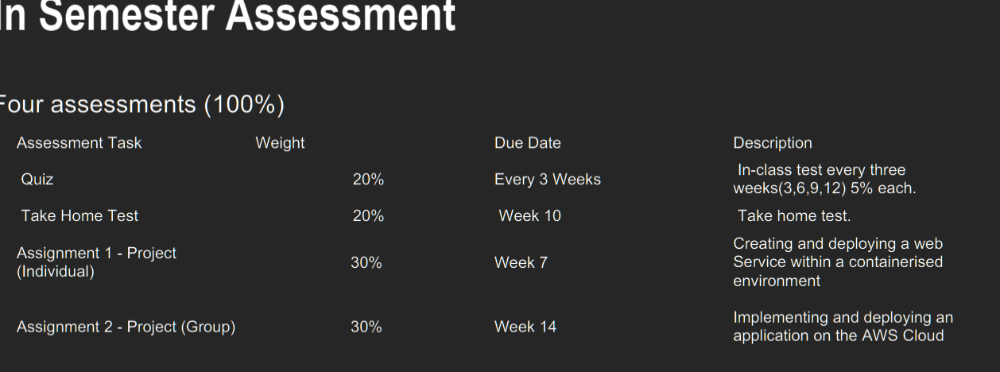

Create time: 2023-02-24  Last update: 2023-02-24

# How to use the FIT study Note document
1. download the [markdown file repository](https://github.com/GreenH47/mynote) and  navigate to the `docs` folder
2. view all the markdown files via [Obsidian vault](https://help.obsidian.md/How+to/Working+with+multiple+vaults) that can show the linked section in the note document    
3. You may find some extra material or program template  repository in the Course Brief introduction for the FIT Note markdown Document (some course don't have )

4. you can view [the web page](https://greenh47.github.io/mynote/) which transfer from MD file online but will lose the extra information or wrong    markdown display

  
# FIT5225 Cloud computing and security Course Brief introduction

  
  
You need to have a good grasp of computer networks (TCP/IP), be familiar with Linux and its shell  scripting and command line, you need to use python a lot and there are many hands-on activities  in this unit.  

Unit learning Objectives  
1. describe fundamental principles and paradigms of cloud computing;  
2. identify appropriate design choices when developing real-world cloud computing applications;  
3. apply different cloud programming methods and tools;  
4. demonstrate a comprehensive understanding of virtualisation and container technologies;  
5. design and implement a highly scalable cloud-based application;  
6. analyse and evaluate the security of the current cloud services and in-cloud applications.  

[FIT5225 - Cloud computing and security](https://handbook.monash.edu/2023/units/FIT5225?year=2023) done for the year 2023. (Semester 1)  

# week 1 Introduction to Cloud Computing
## Lecture

This week we will cover the outline of the unit and then we go through the challenges of distributed systems followed by an introduction to cloud computing  

Introduction to Grid and Cluster Computing
We continue our discussion by introducing Grid and Cluster computing as one of the main pillars of cloud computing.   

Learning Objectives:  
describe fundamental principles and paradigms of cloud computing  

identify appropriate design choices when developing real-world cloud computing applications
## workshop
In this week tutorial classes, you will learn to work with Nectar as an example of a community cloud. You are supposed to run a virtual machine in the Nectar cloud and get familiar with the Nectar dashboard.

Upon successful completion of this tutorial, you will gain the required knowledge to access the Nectar portal, create/modify virtual machines, establish remote connections to your VMs, and perform administration tasks such as installing a web server and opening required ports using security groups.  
## how to set
1. generate ssh key `ssh-keygen`  
2. set instance in nector
3. import your public key to match
4. ssh into your instance `ssh -i <path-to-private-key> ubuntu@<IP-address>` 
5. install the latest version of Apache web server `$ sudo apt update && sudo apt install -y apache2 curl`  
6. print the default Apache  landing page `$ curl localhost`

# Week 2 Grid and Cluster Computing
## Learning Objectives:

-   describe fundamental principles and paradigms of cloud computing
-   identify appropriate design choices when developing real-world cloud computing applications
## Reference
Cluster Computing: [https://en.wikipedia.org/wiki/Computer_cluster  
](https://en.wikipedia.org/wiki/Computer_cluster)Grid Computing: [https://en.wikipedia.org/wiki/Grid_computing](https://en.wikipedia.org/wiki/Grid_computing)
## Lecture

## Tutorial
The main purpose of this tutorial is to help you gain and develop a better understanding of distributed systems, parallel programming, and message passing between processes. You will build, run, and debug multi-threaded programs as well as simple programs that use an MPI emulator to demonstrate message passing between processes running on different CPU cores.本教程的主要目的是帮助您更好地理解分布式系统、并行编程和进程间的消息传递。您将构建、运行和调试多线程程序以及使用 MPI 模拟器的简单程序，以演示在不同 CPU 内核上运行的进程之间的消息传递。