Create time: 2023-02-24  Last update: 2023-02-24

# How to use the FIT study Note document
1. download the [markdown file repository](https://github.com/GreenH47/mynote) and  navigate to the `docs` folder
2. view all the markdown files via [Obsidian vault](https://help.obsidian.md/How+to/Working+with+multiple+vaults) that can show the linked section in the note document    
3. You may find some extra material or program template  repository in the Course Brief introduction for the FIT Note markdown Document (some course don't have )

4. you can view [the web page](https://greenh47.github.io/mynote/) which transfer from MD file online but will lose the extra information or wrong    markdown display

  
# FIT5225 Cloud computing and security Course Brief introduction

  
  
You need to have a good grasp of computer networks (TCP/IP), be familiar with Linux and its shell  scripting and command line, you need to use python a lot and there are many hands-on activities  in this unit.  


Unit learning Objectives  
1. describe fundamental principles and paradigms of cloud computing;  
2. identify appropriate design choices when developing real-world cloud computing applications;  
3. apply different cloud programming methods and tools;  
4. demonstrate a comprehensive understanding of virtualisation and container technologies;  
5. design and implement a highly scalable cloud-based application;  
6. analyse and evaluate the security of the current cloud services and in-cloud applications.  

[FIT5225 - Cloud computing and security](https://handbook.monash.edu/2023/units/FIT5225?year=2023) done for the year 2023. (Semester 1)  

# week 1 Introduction to Cloud Computing
## Lecture
### Learning Objectives:  
describe fundamental principles and paradigms of cloud computing  

identify appropriate design choices when developing real-world cloud computing applications  

Summary  
• Computer Networks vs Distributed Systems  
• Distributed Systems Challenges: heterogeneity, openness, security, scalability, failure handling,  concurrency, transparency, Quality of Service.  
• Cloud computing is all about delivering computing services over the Internet.  
• Technologies significantly contributed to make cloud computing viable: Grid computing,  webservices, virtualization, autonomic computing  
• Cloud Deployment Models: private, community, public, hybrid  
• Cloud Service Models: IaaS, PaaS, SaaS  
• Cloud and distributed computing skill is at the top of the most demanded job skills right now.
### Computer Networks vs Distributed Systems
+ A Computer Network: Is a collection of spatially separated, interconnected computers that  exchange messages based on specific protocols. Computers are addressed by IP addresses.  
+ A Distributed System: Multiple computers on the network working together as a system. The spatial  separation of computers and communication aspects are hidden from users
### Distributed System Challenges
1. Heterogeneity-  use hardware and software resources of  varying characteristics (how to solve: Using standard protocol;  agreed upon message formats; API; Middleware; )   
2. Openness: ability of extending the system in  different ways by adding hardware or software resources (key interfaces; uniform communication mechanism)  
3. Security: aspects of security (Confidentiality; Integrity;  Availability); Security Mechanisms(Encryption; Authentication; Authorization)  
4. Scalability: can handle the growth of the number of users.  
5. Concurrency 并发: access the same resource at the same time;
6. Failure Handling: Detecting, Masking, Tolerating, Recovery, Redundancy  
7. Transparency
8. Quality of Service (QoS) non-functional properties of systems that affect QoS are: Reliability , Security, Performance, Adaptability, Availability 
### Client-Server distributed architectures
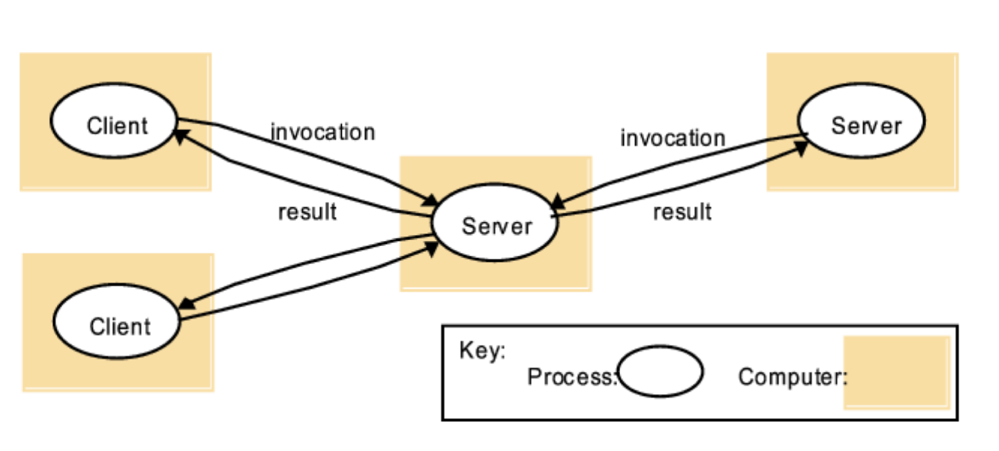
Clients invoke services in servers and results are returned. Servers in turn can become clients to other services
### Peer-to-Peer

Each process in the systems plays a similar role interacting cooperatively as peers  (playing the roles of client and server simultaneously)
### Cloud Computing
An IT paradigm that enables access to shared pools of configurable system resources in form of services that can be rapidly provisioned with minimal management effort, often over the Internet.  d<mark style="background: #3CB371;">elivering computing services over the Internet.</mark>
Avoid expensive up-front investments of establishing their own infrastructure  
Cloud is the “invisible” backend to many application  
### Cloud Service Models
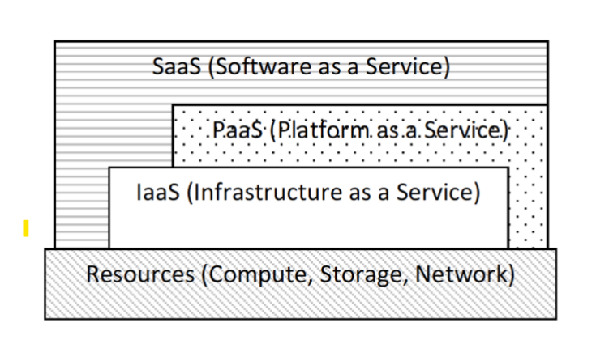
#### Software as a Service (SaaS)
provides <mark style="background: #0000CD;">applications and software to the customer in utility</mark>  based model which is accessible from a thin client interface  such as a Web browser  • Salesforce.com
#### Platform as a Service (PaaS)
provides <mark style="background: #ff0000;">programming languages and tools to deploy  application</mark> onto the cloud infrastructure  Google App Engine
#### Infrastructure as a Service (IaaS)
provides capabilities for the customers to <mark style="background: #3CB371;">provision  computational resources such as processing, storage,  network, and other fundamental computing </mark>resources Virtual  Machines(VMs)/Containers  • Example: Amazon EC2/


### Grid Computing
computer cluster is a <mark style="background: #0000CD;">set of computers connected by a local area network (LAN) that work  together</mark> can be viewed as a single system  
Grid computing: A type of parallel and distributed system to share compute and storage resources  distributed across different administrative domains
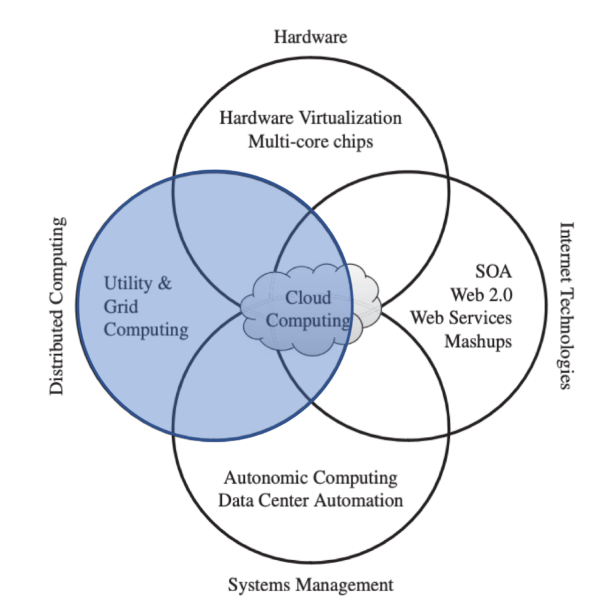
### Web service
A Web service is a s<mark style="background: #ff0000;">oftware system designed to support interoperable machine-to-machine  interaction over a network</mark> using HTTP and technologies such as XML, SOAP, WSDL, and UDDI. 

### Hardware Virtualization

hides the physical characteristics of a computing platform from the users, presenting  instead an abstract computing platform
### Autonomic Computing
Autonomic computing refers to the <mark style="background: #D2691E;">self-managing</mark> characteristics of distributed  computing resources, <mark style="background: #D2691E;">adapting to unpredictable changes</mark> while hiding intrinsic complexity to  operators and users
## quiz

  


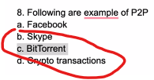


## workshop
In this week tutorial classes, you will learn to work with Nectar as an example of a community cloud. You are supposed to run a virtual machine in the Nectar cloud and get familiar with the Nectar dashboard.

Upon successful completion of this tutorial, you will gain the required knowledge to access the Nectar portal, create/modify virtual machines, establish remote connections to your VMs, and perform administration tasks such as installing a web server and opening required ports using security groups.  
### how to set
1. generate ssh key `ssh-keygen`  
2. set instance in nector
3. import your public key to match
4. ssh into your instance `ssh -i <full-path-to-private-key> ubuntu@<IP-address>` 
5. install the latest version of Apache web server `$ sudo apt update && sudo apt install -y apache2 curl`  
6. print the default Apache  landing page `$ curl localhost`


# Week 2 Grid and Cluster Computing
## Learning Objectives:

-   describe fundamental principles and paradigms of cloud computing
-   identify appropriate design choices when developing real-world cloud computing applications
## Reference
Cluster Computing: [https://en.wikipedia.org/wiki/Computer_cluster  
](https://en.wikipedia.org/wiki/Computer_cluster)Grid Computing: [https://en.wikipedia.org/wiki/Grid_computing](https://en.wikipedia.org/wiki/Grid_computing)
## Lecture
### Learning Outcomes  
1. describe fundamental principles and paradigms of cloud computing;  
2. identify appropriate design choices when developing real-world cloud computing applications;  
### Flynn Matrix
+ Single instruction stream, single data  stream (SISD)  
+ Multiple instruction streams, single data  stream (MISD)  
+ Single instruction stream, multiple data  streams (SIMD)  
+ Multiple instruction streams, multiple data  streams (MIMD
+ 
+ 
### parallel Computing Architectures
选择哪种系统取决于应用程序的特性和要求，以及系统的性能和可伸缩性需求。 
+ UMA系统适  合规模较小、数据共享需求较强的多处理器系统； 
+ SMP系统则更适合规模较大、数据共享需求 相对较弱的多处理器系统；
+ NUMA系统适合规模更大的多处理器系统，特别是需要高性能和可 伸缩性的应用程序； 
+ MPP系统适合处理大规模数据集和需要大量计算资源的应用程序
#### Massively Parallel Processors (MPP)
100+ nodes with a high-speed interconnection network/switch; Each node has 1+ processors, sharing of the main memory;  Separate copy of OS runs on each node  
These MPP databases([BigQuery Enterprise Data Warehouse  |  Google Cloud](https://cloud.google.com/bigquery/?utm_source=google&utm_medium=cpc&utm_campaign=japac-AU-all-en-dr-BKWS-all-rmkt-trial-EXA-dr-1605216&utm_content=text-ad-none-none-DEV_c-CRE_648938225949-ADGP_Hybrid+%7C+BKWS+-+EXA+%7C+Txt+~+Data+Analytics_BigQuery_big+query_main-KWID_43700075272952174-kwd-63326440124&userloc_9071445-network_g&utm_term=KW_google%20bigquery&gclid=Cj0KCQiA6rCgBhDVARIsAK1kGPKA3oXdZG1wbH_J35kmtVKdu9pO4Jk_3uhmNYYiC39FvMBaQEQhJ0caAmGnEALw_wcB&gclsrc=aw.ds)) are designed to handle large volumes of data and provide high  performance and scalability. They are commonly used in data warehousing and business intelligence application
#### Symmetric Multi-processors (SMP)
All global resources are shared among processors;  Nodes run the same OS (Enterprise servers; High-performance computing cluster; )   
SMP architecture is commonly used in medium- to large-scale multiprocessor systems, and  provides a simple and efficient way to achieve multiprocessing without the complexities of  NUMA (Non-Uniform Memory Access) or MPP (Massively Parallel Processing) architectures.  SMP systems are typically used for applications that require shared access to a moderate  amount of memory and do not require high scalability or perform


#### Non-Uniform Memory Access (NUMA)
Each processor has a global view of the available memory shared- address-space computer with local and global  memories (supercomputer; High-performance computing cluster)  
NUMA systems are typically used for large-scale parallel processing applications that require  high performance and scalability. They provide fast access to memory for each processor by  dividing the system memory into local and remote memory regions, and optimizing access to  these regions based on the location of the data being accessed. NUMA architecture can be  more complex and expensive to implement than UMA architecture, but it can provide better  performance and scalability for certain types of application

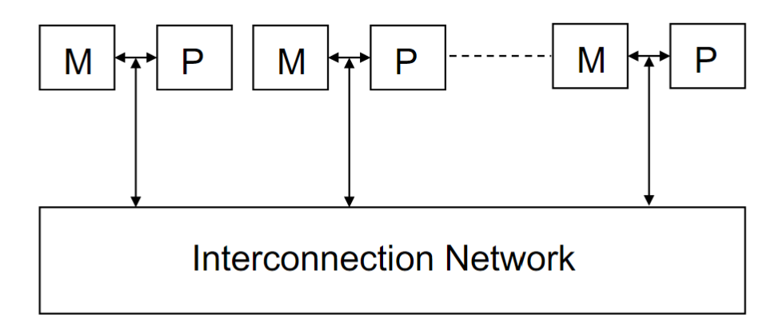
#### Clusters
Collection of workstations interconnected by a high-speed network, with nodes running a single system image

#### Distributed Systems
Grids/P2P/Internet Computing/Clouds
### Amdahl’s Law
$1/((1-p)+(p/n))$  
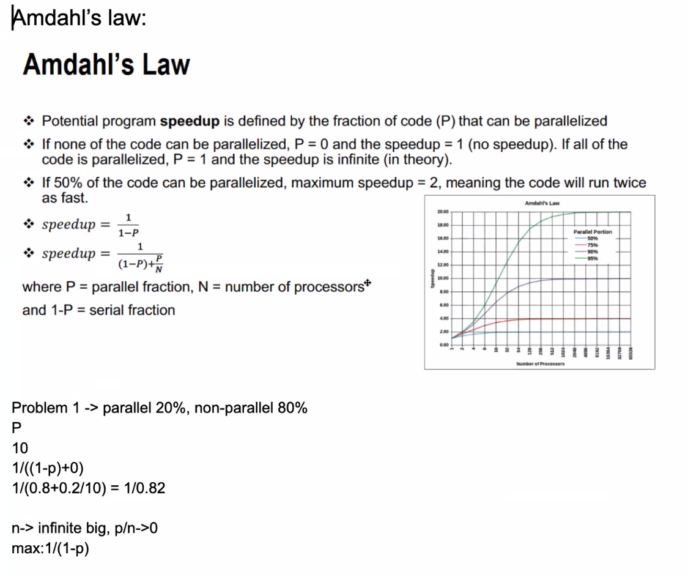
### Parallel Programming
Shared Memory  • Threads  • Message Passing  • Data Parallel  • Hybrid  
Why?  
- To save time  
- Solve bigger and more complex problems  
- Leverage concurrency  
- It’s very expensive to build high capacity and powerful CPUs and connect them together 

How  
- Phase parallel  
- Divide and conquer  
- Pipeline  
- Process farm  
- Work pool  
Limitations and Challenges  
+ Finding efficient ways of parallelizing the source code
+ Designing and developing scalable algorithms is challenging
+ Message passing and job submission are not automated and need to be taken care of by the  user/programmer
+ Managing jobs in a parallel and distributed environment is prone to lots of errors, think about  communication, resource allocation, etc
### Cluster Computing
Cluster computing is a collection of tightly or loosely connected computers that work together so that they act as a single entity. The connected computers execute operations all together thus creating the idea of a single system. <mark style="background: #0000CD;">The clusters are generally connected through fast local area networks (LANs)</mark>
### Grid Computing
grid as a system that coordinates resources which are not subject to centralized control,  using standard, open, general-purpose protocols and interfaces to deliver nontrivial qualities of service
### Summary of Cluster, Grid, and Cloud Computing

### Open Multi-Processing (OpenMPI)
A master thread forks a number of sub-threads and divides tasks between them    
Open Multi-Processing (OpenMP) is an API that includes directives for multi-threaded, shared memory parallel programming. Thread-based rather than using message passing
### Message Passing Interface (MPI)
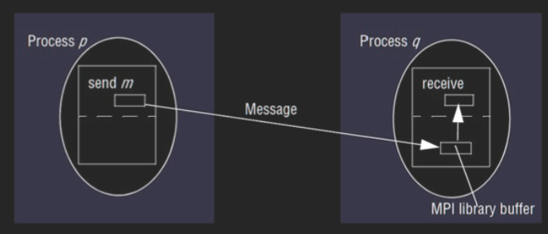
MPI is a standardized and portable message-passing system to function on a wide variety of  parallel computers.  Widely adopted for inter-process communication in parallel systems. • Supports both p2p and collective modes of communication

## QUIZ


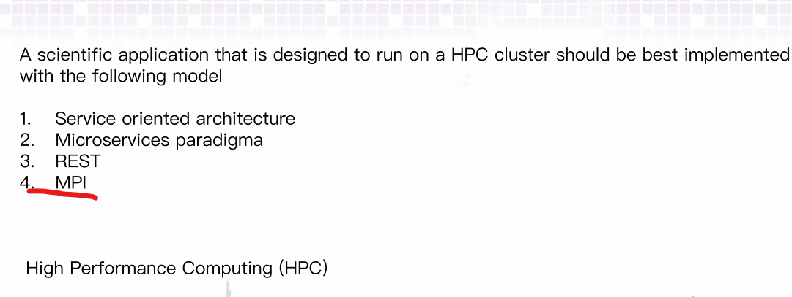


## Tutorial
The main purpose of this tutorial is to help you gain and develop a better understanding of distributed systems, parallel programming, and message passing between processes. You will build, run, and debug multi-threaded programs as well as simple programs that use an MPI emulator to demonstrate message passing between processes running on different CPU cores.本教程的主要目的是帮助您更好地理解分布式系统、并行编程和进程间的消息传递。您将构建、运行和调试多线程程序以及使用 MPI 模拟器的简单程序，以演示在不同 CPU 内核上运行的进程之间的消息传递。

# Week 3 Virtualization
## Lecture
+ Hardware Virtualization  
+ Virtualization Features: Isolation, Encapsulation, Portability, and Interposition’  
+ Hypervisor, Virtual Machine, Guest Operating System, Host  
+ Processor, Memory and I/O Devices virtualization  
+ Live and cold VM migration  
+ Case studies: Xen and VMWare  

describe fundamental principles and paradigms of cloud computing;  
demonstrate a comprehensive understanding of virtualisation and container technologies;  

### Virtualization
Virtualization is a broad concept that refers to the creation of a virtual version of something, whether  hardware, a software environment, storage, or a network.  

#### Motivations for virtualization
+ Optimal allocation of the virtual machines to physical server  
+ Virtualization is very relevant to the provision of cloud computing (multi-tenancy)  
+ Create and destroy virtual machines readily and with little overhead  
+ Several different operating system environments on a single desktop computer  
#### Virtualization Features
+ Isolation隔离 (Fault isolation, performance, software isolation)  
+ Encapsulation封装 (Cleanly capture all VM state, enables VM snapshots, clone VMs easily, make copies)  
+ Portability可移植性 (Independent of physical hardware, enables live and cold migration of VMs)  
+ Interposition插入(Transformations on instructions, memory, I/O Enables transparent resource over commitment, encryption, compression, replication)
#### Virtualization Types
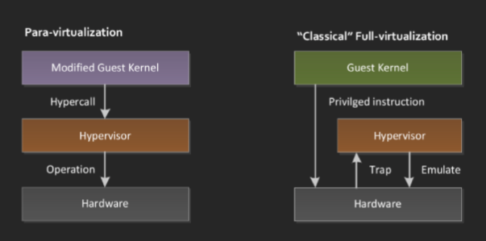
+ Full virtualization : identical interface to the underlying physical architecture  unmodified guest operating system(VMware, Virtualbox)  
+ Paravirtualization : guest operating systems to communicate with the hypervisor.  guest os to be modified in order to interact with paravirtualization interface  communicates with the hypervisor using driver  higher performance (XEN)

### Hardware Virtualization  
The term virtualization is often synonymous with hardware virtualization/system virtualization.  “a technique for hiding the physical characteristics of computing resources which allows having  multiple virtual machines (VMs) over the underlying physical machine architecture, with each virtual  machine running a separate operating system instance.
### Hypervisor 管理程序

+ Hardware virtualization is implemented by a thin layer of software on  top of the underlying physical machine architecture referred to as  Hypervisor (Virtual Machine Monitor).  
+ Virtual Machine: A representation of a real machine using  hardware/software that can host a guest operating system  
+ Guest Operating System: An operating system that runs in a virtual  machine  
+ Host: the original environment where the guest OS is supposed to  be managed

### Computing Systems
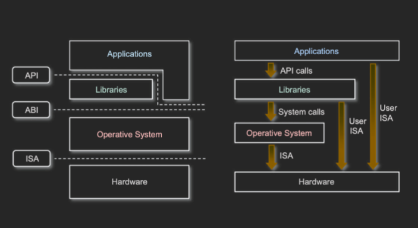
1. Instruction Set Architecture (ISA)  
2. Application Binary Interface (ABI)  
3. Application programming interface (API)  
For any operation to be performed in the  application level API, ABI and ISA are  responsible for making it happen

### Virtualizing Memory

## Tutorial
upon successful completion of this tutorial, you will gain the required knowledge to access Oracle Cloud Infrastructure  (OCI), create/modify virtual machines, running a micro web framework, and working with Postman  
1. `sudo apt-get update && sudo apt-get install -y python3-pip curl && pip3 install flask` install the `python3-pip` and `curl` packages, and then install the `flask` package using `pip3`  
2. `touch flask_script.py` create py file  
3. `nano flask_script.py` open the file in the nano text editor 
4. `sudo apt update` check for any updates available for the installed packages and update  
5. `sudo apt install firewalld` install firewall service that provides a dynamically managed firewall with support for network/firewall zones
6. `sudo systemctl enable firewalld` `firewalld` service will start automatically every time the system boots up  
7. `sudo firewall-cmd --permanent --zone=public --add-port=5000/tc` add a permanent rule to the firewall on Ubuntu to allow incoming traffic on port 5000 for TCP protocol.  
8. `sudo firewall-cmd --reload` reload the `firewalld` firewall configuration. This means that any changes made to the firewall rules, such as adding or removing ports, will take effect immediately without having to restart the firewall service.  
9. `python3 flask_script.py &`  command that runs the `flask_script.py` Python script in the background as a separate process  
10. `curl -iX GET <IP-ADDR>:5000/` use the `curl` tool to make an HTTP GET request to the web server running on the specified IP address and port 5000. The server will then respond with an HTTP response that includes the requested data, and the `-i` option will cause `curl` to display the HTTP header along with the response body.

# Week4  Containers
describe fundamental principles and paradigms of cloud computing;  
demonstrate a comprehensive understanding of virtualisation and container technologies
## Lecture
VMs and Containers  
Docker as a containers enabler (Docker Engine Components  Docker Images, Image registries, Layers, Dockerfile )
Container Orchestration (DockerSwarm  Kubernetes ) 
### Virtualization Advantages and Problems
Advantages:  
+ Minimize hardware costs (CapEx)  
+ Easily move VMs to other data centre  
+ Consolidate idle workloads  
+ Easier automation (Lower OpEx)

Problems:  
+ Every VM requires its own dedicated OS  
+ Needs maintenance, update  
+ VMs are slow to boot  Portability issues Between hypervisors and cloud platforms  
### Containers
+ Containers on a single host share a single OS.  
+ Containers are fast to start  
+ Containers are ultra-portable (own file system/data, own networking)  
+ Containers are isolated
+ Multiple copies can be run on the same machine or different machine ⇒ Scalable  Same image can run on a personal machine, in a data centre or in a cloud
+ Can be stopped, saved and moved to another machine or for later run  
### Containers vs. VMs
[What’s the Diff: VMs vs. Containers](https://www.backblaze.com/blog/vm-vs-containers/)
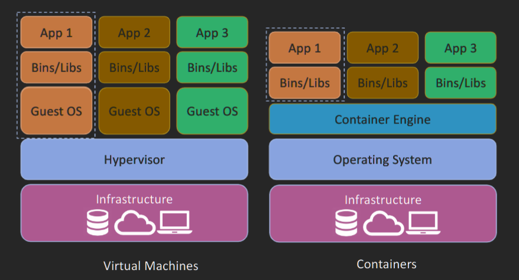  

|                              | VMs                                       | Containers                                    |
| ---------------------------- | ----------------------------------------- | --------------------------------------------- |
| Type                         | Heavyweight                               | Lightweight                                   |
| Performance                  | Limited performance                       | Native performance                            |
| CPU overhead                 | >10%                                      | <5%                                           |
| Disk I/O                     | >50%                                      | Negligible                                    |
| OS                           | Each VM runs in its own OS                | All containers share the host OS              |
| Virtualization               | Hardware-level virtualization             | OS virtualization                             |
| Boot time                    | In minutes                                | In seconds/milliseconds                       |
| Memory                       | Allocates required memory                 | Requires less memory space                    |
| Security                     | Fully isolated and hence more secure (hypercalls)      | Process-level isolation, possibly less secure (syscalls on the shared kernel)|
| Impact on Legacy Application | Low-medium                                | High impact on legacy application             |
| applications                 | Multiple applications on multiple servers | Many copies of a single application           |
|                              |                                           |                                               |

### Docker
+ made Linux containers usable for everybody.
+ Most of the project and its tools are written in Golang
### DevOps  
- Ops Perspective  
	- download an image,  
	- start a new container,  
	- log in to the new container,
	- run a command inside of it, and then destroy it.  

- Dev Perspective  
	- pull some app-code from GitHub,  
	- inspect a Dockerfile,  
	- containerize the app,  
	- run it as a container.  

### Docker Engine
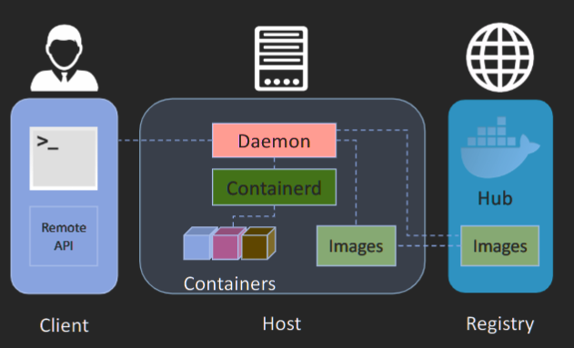  
+ Docker Daemon manages containers, images, builds and  more  
+ Docker Client communicates with the Docker Daemon to  execute commands  
+ A REST API can be used for interacting with the Docker  Daemon remotely  
+ Docker Images are read-only templates that you build from a  set of instructions written in your Dockerfile  
+ Docker container wraps an application’s software into a box  with everything the application needs to run
+ Docker registry is a storage and distribution system for  named Docker images.  The registry allows Docker users to pull images locally, as  well as push new images to the registry (given adequate  access permissions when applicable).

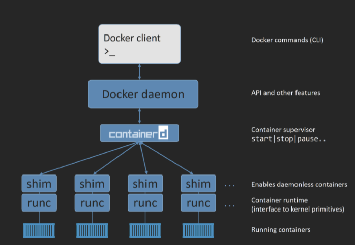  
Docker engine main components:  
- Docker client  
- Docker daemon  
	- Image management, image builds, the  REST API, authentication, security, core  networking, and orchestration  
- containerd  
	- container lifecycle management  
	- start | stop | pause | rm....  
- runc  
- a small, lightweight CLI wrapper for  libcontainer

### Images
Containers are built from images and can be saved as image  The process of getting images onto a Docker host is called pulling `$ docker image pull ubuntu:latest`  ubuntu is the repository and latest is the tag
### layers
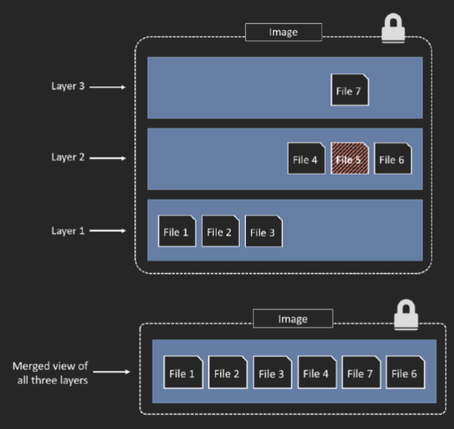  

+ Docker image is just a bunch of loosely- connected read-only layer  
+ image is built layer by layer  
+ Layers in an image can be inspected by Docker  commands  
+ A file in the higher layer obscures the file directly  below it.  This allows updated versions of files to be added as  new layers to the image  
+ Multiple images can, and do, share layers. This leads  to efficiencies in space and performance
### Starting a new container  
`$ docker container run --name  ctr1 -it alpine:latest sh` This command creates and runs a new container named ctr1 from the alpine:latest image and attaches an interactive shell to it. 
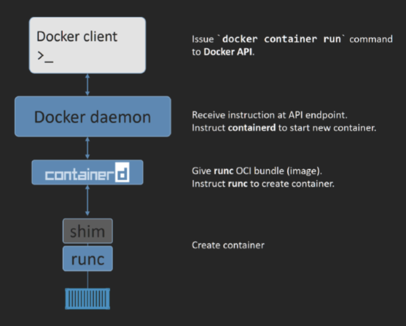  
1. When you type command into the Docker CLI, the Docker  client converts them into the appropriate API payload and  POSTs them to the correct API endpoint  
2. The API is implemented in the daemon  
3. Once the daemon receives the command to create a new  container, it makes a call to containerd   
4. containerd uses runc to create containe  
5. runc interfaces with the OS kernel to pull together all of the  constructs necessary to create a container (namespaces,  cgroups etc
### Docker command
- `$ docker container ls`: This command lists all the running containers on the system. It shows information such as container ID, image name, command, creation time, status, and port mappings.
- `$ docker container exec -it 3027eb644874 bash`: This command executes a bash shell in an existing container with ID 3027eb644874. The -it option makes the shell interactive and attaches it to the terminal.
- `$ docker container stop 3027eb64487`: This command stops a running container with ID 3027eb64487. It sends a SIGTERM signal to the main process inside the container and waits for a grace period before killing it with SIGKILL if it does not exit.
- `$ docker container rm 3027eb64487`: This command removes a stopped container with ID 3027eb64487. It deletes all the files and data associated with the container from the system.

## Tutorial
### Install Docker
1. `sudo apt update` updates the package index and the software repositories on the system. It retrieves the information about the new or updated packages versions, dependencies, and their URLs.  
2. `sudo apt install -y apt-transport-https ca-certificates curl gnupg software-properties-common lsb-release` this command is installing essential packages required for managing and installing software  
3. `sudo mkdir -m 0755 -p /etc/apt/keyrings`  this command creates a new directory named `keyrings` under the `/etc/apt` directory with specified permissions. The purpose of this directory is to store GPG keys that are required to authenticate packages in apt repositories. 
4. `curl -fsSL https://download.docker.com/linux/ubuntu/gpg | sudo gpg --dearmor -o /etc/apt/keyrings/docker.gpg`  downloads the Docker GPG key file, decrypts it using `gpg`, and saves it in the `/etc/apt/keyrings` directory with the name `docker.gpg`. This allows the `apt` package manager to authenticate and verify packages from Docker repositories.  
5. `sudo chmod a+r /etc/apt/keyrings/docker.gpg` this command allows all users to read the Docker GPG key file (`docker.gpg`). This is necessary to allow the `apt` package manager to authenticate and verify packages from Docker repositories.  
6. `echo "deb [arch=$(dpkg --print-architecture) signed-by=/etc/apt/keyrings/docker.gpg] https://download.docker.com/linux/ubuntu $(lsb_release -cs) stable" | sudo tee /etc/apt/sources.list.d/docker.list > /dev/null` this command adds the Docker repository information to the `docker.list` file in the `/etc/apt/sources.list.d` directory. This file is used by the `apt` package manager to download and install packages from the Docker repository using the GPG key that was installed earlier.  
7. `sudo apt update`  
8. `sudo apt install docker-ce docker-ce-cli containerd.io docker-buildx-plugin docker-compose-plugin` this command installs the Docker platform and related components using the `apt` package manager. After installation, the `docker` command should be available in the terminal, and Docker should be ready to use on the system  
9.  `sudo usermod -aG docker ${USER}`  this command adds the current user to the `docker` group, enabling them to use Docker without needing to enter `sudo` before every command. However, you may need to log out of the current shell or open a new terminal window for the group changes to take effect.
### Managing Containers
1. the `docker run hello-world` command downloads the `hello-world` image from the Docker Hub repository and creates a new container using that image. The container then prints a message on the command-line interface that confirms the successful installation of Docker on the system  
2.  `docker ps -a` command lists all the containers on the system, including those that are currently running and those that have stopped. It provides information such as the container's ID, image name, status, creation time, and exit code.  
3. `docker image list` s all the Docker images that are present on the system. It provides information such as the image's repository name, tag, image ID, and creation time.  
4. `docker pull ubuntu`  downloads the latest version of the Ubuntu image from the Docker Hub repository and saves it locally on the system  
5. `docker run ubuntu sh -c "echo Hello FIT5225 from ubuntu; ls; echo bye guys"` creates a container from the `ubuntu` image and runs a command to print "Hello FIT5225 from ubuntu", list the contents of the current directory, and print "bye guys".  
6. `docker run -it ubuntu bash` command creates a new container from the `ubuntu` image and starts a new interactive session with a Bash shell or command prompt inside the container By default, the container will not be deleted after exit and if  you run `sudo docker ps -a` again you will see a list of existing containers.  
7. `docker run -it --rm ubuntu bash` `--rm` is an option to the `run` command that tells Docker to automatically remove the container when it exits. This helps keep the disk space of your machine clean by automatically cleaning up unnecessary containers. When executed, the `docker run -it --rm ubuntu bash` command creates a new container from the `ubuntu` image, starts a new interactive session with a Bash shell or command prompt inside the container, and automatically removes the container when it exits.  
8. `docker run -t -d ubuntu` command creates a new container from the `ubuntu` image, starts the container in the background or in detached mode, and returns the container ID to the console.  
9. `docker exec -i -t <container-id> bash` To create an interactive shell to a running container 
10. `docker stop <container-id>` To stop the container  
11. `docker rm <container-id>` to And to remove the container  
12. `docker rm -f $(docker ps -a -q)` And to remove all containers

### Running a web Server 
1. `docker run --name myserver -p 8080:80 -d nginx`  
2. Create a sample html file in a local folder under your home directory named “www”, name it as index.html 
3. Change the current directory to your home directory by running the following command: `cd ~` Create a new directory named "www" in your home directory by running the following command: `mkdir www`  
4. Create a new file named "index.html" in the "www" directory and open it with the Nano editor by running the following command:`nano index.html`  Copy and paste the following content into the Nano editor Save the file and exit the Nano editor by pressing `Ctrl-X`, then `Y`, then `Enter`
5. `curl <ip address of your machine>:8080` execute a GET request to the specified IP address of your machine on port 8080 using the `curl` utility  Open port 8080 in your security group, verify that you can access the web page using your browser 
### Creating Docker Images  
 `mkdir demo_<YourName>`  Create a requirements.txt file `flask`;   
 Create a file named my_script.py;  
 ```py
 from flask import Flask  
app = Flask(__name__)  
@app.route("/")  
def hello():  
	return "Hello World from FIT5225!"  
if __name__ == "__main__":  
	app.run(host='0.0.0.0'
```  
 Create a file named Dockerfile:  
 ```
 FROM python:3.7-alpine  
WORKDIR /code  
ADD my_script.py /code  
COPY requirements.txt requirements.txt  
RUN pip install -r requirements.txt  
CMD ["python", "/code/my_script.py"]
```
Dockerfile that starts with a python 3.7 image based on Alpine Linux, sets the working directory to `/code`, adds `my_script.py` to the working directory, copies the `requirements.txt` file to the working directory, installs the requirements using pip, and finally runs the command `python /code/my_script.py` when the container starts.  
`docker build -t flask-app .` build an image from the Dockerfile  
`docker run -d -p 5000:5000 --name my-flask-app flask-app`  starts a Docker container in detached mode (`-d`), maps port `5000` inside the container to port `5000` on the host machine (`-p 5000:5000`), names the container `my-flask-app` (`--name my-flask-app`), and uses the `flask-app` image to start the container.  

# Week 5 Container Orchestration
.Container orchestration is the automation of the operational effort required to run containerized workloads and services. This includes a wide range of things software teams need to manage a container's lifecycle, including provisioning, deployment, scaling (up and down), networking, load balancing and more. This week, we will introduce DockerSwarm and Kubernetes as two well-known container orchestration methods when we run a cluster of containers.  
-   describe fundamental principles and paradigms of cloud computing
-   demonstrate a comprehensive understanding of virtualisation and container technologies
## Lecture

## Tutorial
1. we need to create 3 VMs in Oracle cloud, each with 2 cores (AMD) and 8GB RAM, use Ubuntu 22.04 image and  tick the Burstable option with 50% baseline. This option will give you 50% cost saving, but it’s able to burst to higher  CPU frequency when needed.  Name the 3 VMs as: k8s-master, k8s-worker1, k8s-worker2  You need to open TCP port 6443 on your controller(master) and worker nodes.
2. Use ssh to connect to all 3 VMs and follow these steps `sudo apt update && sudo apt install -y apt-transport-https ca-certificates curl gnupg software-properties-common lsb-release && sudo mkdir -m 0755 -p /etc/apt/keyrings && curl -fsSL https://download.docker.com/linux/ubuntu/gpg | sudo gpg --dearmor -o /etc/apt/keyrings/docker.gpg && sudo chmod a+r /etc/apt/keyrings/docker.gpg && echo "deb [arch=$(dpkg --print-architecture) signed-by=/etc/apt/keyrings/docker.gpg] https://download.docker.com/linux/ubuntu $(lsb_release -cs) stable" | sudo tee /etc/apt/sources.list.d/docker.list > /dev/null && sudo apt update && sudo apt install -y docker-ce docker-ce-cli containerd.io docker-buildx-plugin docker-compose-plugin && sudo usermod -aG docker ${USER}` Then logout and login again  
3. Use ssh to connect to all 3 VMs and follow these steps: `wget https://github.com/Mirantis/cri-dockerd/releases/download/v0.3.1/cri-dockerd_0.3.1.3-0.ubuntu-jammy_amd64.deb && sudo dpkg -i cri-dockerd_0.3.1.3-0.ubuntu-jammy_amd64.deb && sudo apt update && sudo apt-get install -y apt-transport-https ca-certificates curl && sudo curl -fsSLo /etc/apt/keyrings/kubernetes-archive-keyring.gpg https://packages.cloud.google.com/apt/doc/apt-key.gpg && echo "deb [signed-by=/etc/apt/keyrings/kubernetes-archive-keyring.gpg] https://apt.kubernetes.io/ kubernetes-xenial main" | sudo tee /etc/apt/sources.list.d/kubernetes.list && sudo apt update && sudo apt-get install -y kubelet kubeadm kubectl && sudo apt-mark hold kubelet kubeadm kubectl && kubeadm version` 
4. Open ports with iptables(Oracle Cloud)  Oracle-provided images have strict traffic control for security reasons. In addition to the VCN security list, you also need  to edit the iptables for all nodes `sudo nano /etc/iptables/rules.v4` 