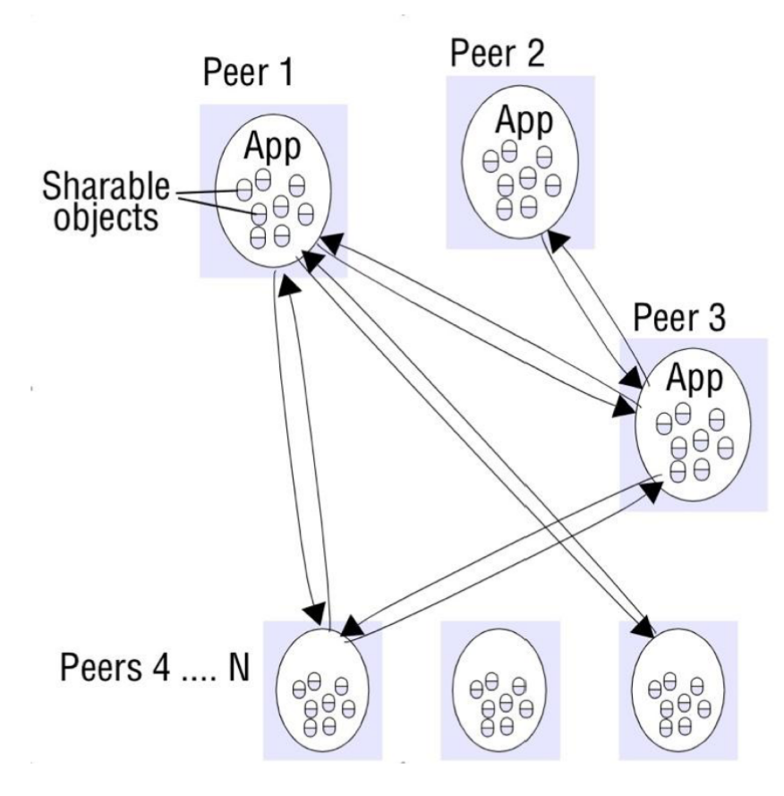
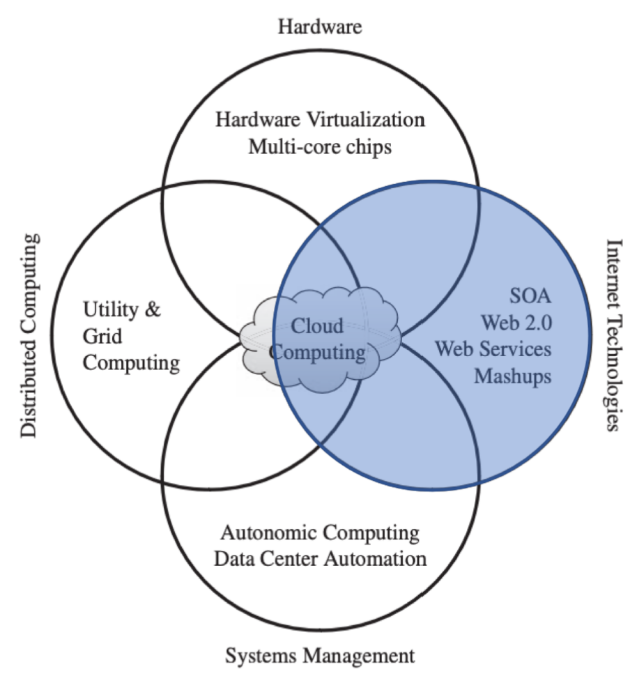
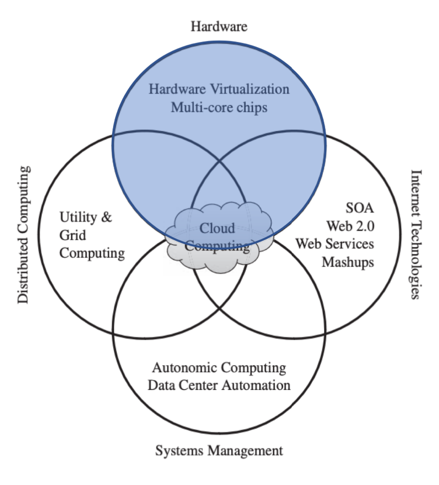
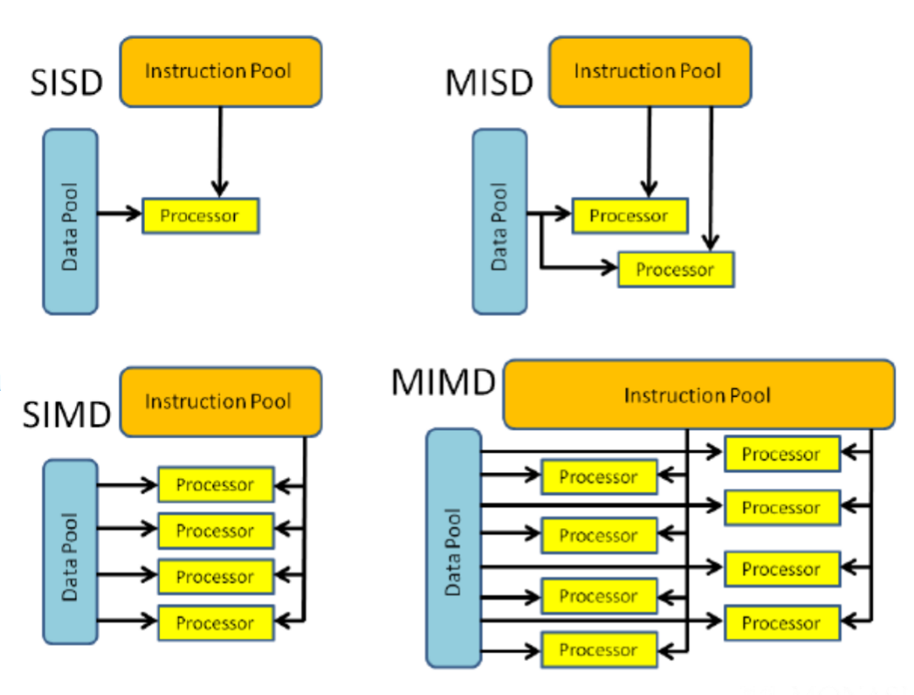
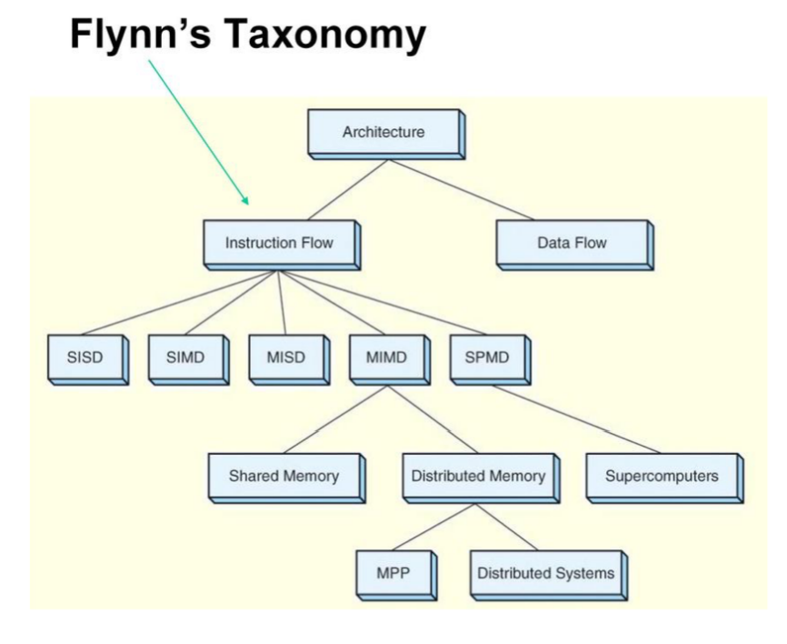
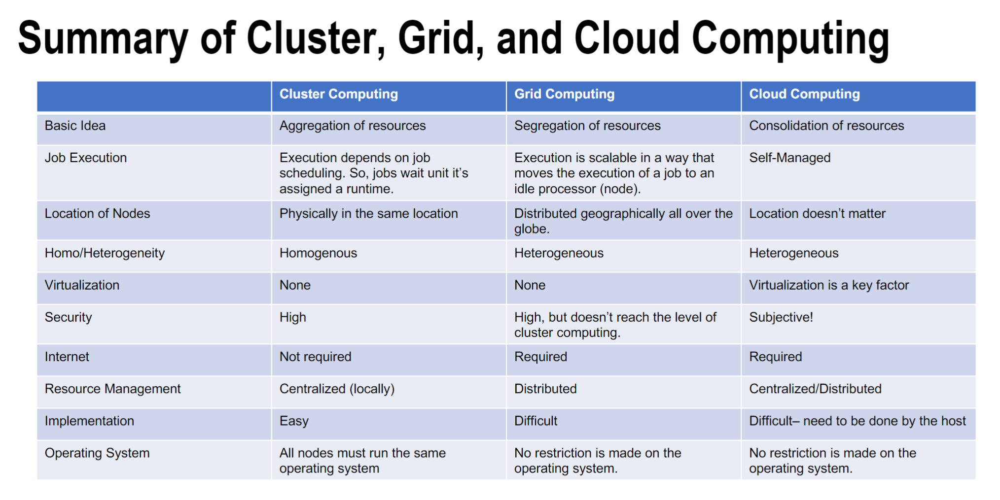
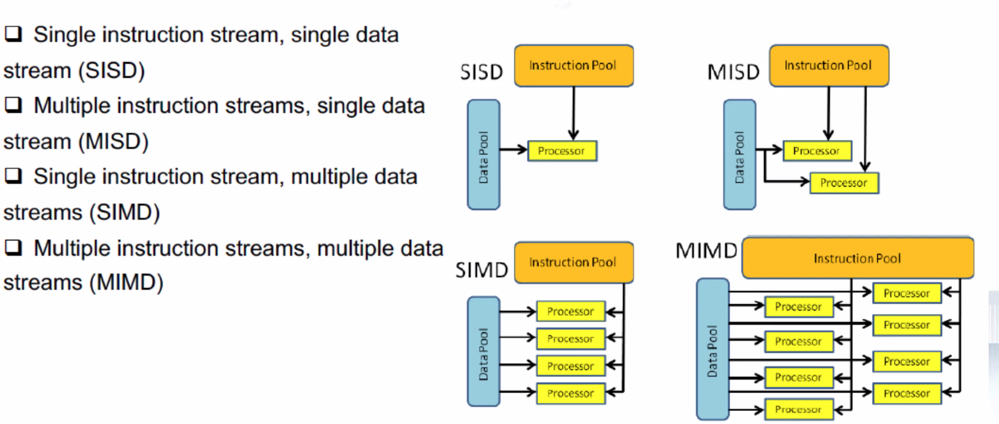
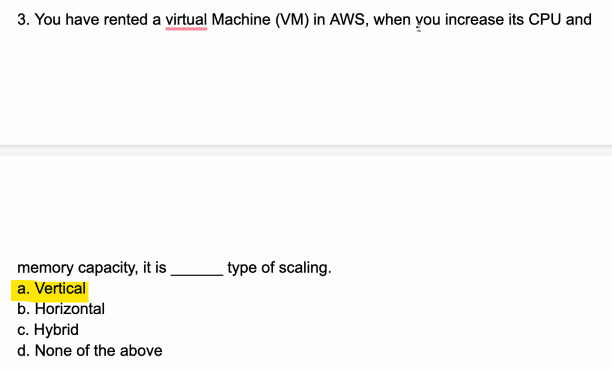
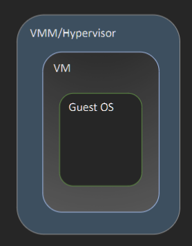

Create time: 2023-02-24  Last update: 2023-02-24

# How to use the FIT study Note document
1. download the [markdown file repository](https://github.com/GreenH47/mynote) and  navigate to the `docs` folder
2. view all the markdown files via [Obsidian vault](https://help.obsidian.md/How+to/Working+with+multiple+vaults) that can show the linked section in the note document    
3. You may find some extra material or program template  repository in the Course Brief introduction for the FIT Note markdown Document (some course don't have )

4. you can view [the web page](https://greenh47.github.io/mynote/) which transfer from MD file online but will lose the extra information or wrong    markdown display

  
# FIT5225 Cloud computing and security Course Brief introduction

  
  
You need to have a good grasp of computer networks (TCP/IP), be familiar with Linux and its shell  scripting and command line, you need to use python a lot and there are many hands-on activities  in this unit.  

Unit learning Objectives  
1. describe fundamental principles and paradigms of cloud computing;  
2. identify appropriate design choices when developing real-world cloud computing applications;  
3. apply different cloud programming methods and tools;  
4. demonstrate a comprehensive understanding of virtualisation and container technologies;  
5. design and implement a highly scalable cloud-based application;  
6. analyse and evaluate the security of the current cloud services and in-cloud applications.  

[FIT5225 - Cloud computing and security](https://handbook.monash.edu/2023/units/FIT5225?year=2023) done for the year 2023. (Semester 1)  

# week 1 Introduction to Cloud Computing
## Lecture
### Learning Objectives:  
describe fundamental principles and paradigms of cloud computing  

identify appropriate design choices when developing real-world cloud computing applications  

Summary  
• Computer Networks vs Distributed Systems  
• Distributed Systems Challenges: heterogeneity, openness, security, scalability, failure handling,  concurrency, transparency, Quality of Service.  
• Cloud computing is all about delivering computing services over the Internet.  
• Technologies significantly contributed to make cloud computing viable: Grid computing,  webservices, virtualization, autonomic computing  
• Cloud Deployment Models: private, community, public, hybrid  
• Cloud Service Models: IaaS, PaaS, SaaS  
• Cloud and distributed computing skill is at the top of the most demanded job skills right now.
### Computer Networks vs Distributed Systems
+ A Computer Network: Is a collection of spatially separated, interconnected computers that  exchange messages based on specific protocols. Computers are addressed by IP addresses.  
+ A Distributed System: Multiple computers on the network working together as a system. The spatial  separation of computers and communication aspects are hidden from users
### Distributed System Challenges
1. Heterogeneity-  use hardware and software resources of  varying characteristics (how to solve: Using standard protocol;  agreed upon message formats; API; Middleware; )   
2. Openness: ability of extending the system in  different ways by adding hardware or software resources (key interfaces; uniform communication mechanism)  
3. Security: aspects of security (Confidentiality; Integrity;  Availability); Security Mechanisms(Encryption; Authentication; Authorization)  
4. Scalability: can handle the growth of the number of users.  
5. Concurrency 并发: access the same resource at the same time;
6. Failure Handling: Detecting, Masking, Tolerating, Recovery, Redundancy  
7. Transparency
8. Quality of Service (QoS) non-functional properties of systems that affect QoS are: Reliability , Security, Performance, Adaptability, Availability 
### Client-Server distributed architectures

Clients invoke services in servers and results are returned. Servers in turn can become clients to other services
### Peer-to-Peer

Each process in the systems plays a similar role interacting cooperatively as peers  (playing the roles of client and server simultaneously)
### Cloud Computing
An IT paradigm that enables access to shared pools of configurable system resources in form of services that can be rapidly provisioned with minimal management effort, often over the Internet.  d<mark style="background: #3CB371;">elivering computing services over the Internet.</mark>
Avoid expensive up-front investments of establishing their own infrastructure  
Cloud is the “invisible” backend to many application  
### Cloud Service Models

#### Software as a Service (SaaS)
provides <mark style="background: #0000CD;">applications and software to the customer in utility</mark>  based model which is accessible from a thin client interface  such as a Web browser  • Salesforce.com
#### Platform as a Service (PaaS)
provides <mark style="background: #ff0000;">programming languages and tools to deploy  application</mark> onto the cloud infrastructure  Google App Engine
#### Infrastructure as a Service (IaaS)
provides capabilities for the customers to <mark style="background: #3CB371;">provision  computational resources such as processing, storage,  network, and other fundamental computing </mark>resources Virtual  Machines(VMs)/Containers  • Example: Amazon EC2/

### Grid Computing
computer cluster is a <mark style="background: #0000CD;">set of computers connected by a local area network (LAN) that work  together</mark> can be viewed as a single system  
Grid computing: A type of parallel and distributed system to share compute and storage resources  distributed across different administrative domains

### Web service
A Web service is a s<mark style="background: #ff0000;">oftware system designed to support interoperable machine-to-machine  interaction over a network</mark> using HTTP and technologies such as XML, SOAP, WSDL, and UDDI. 

### Hardware Virtualization

hides the physical characteristics of a computing platform from the users, presenting  instead an abstract computing platform
### Autonomic Computing
Autonomic computing refers to the <mark style="background: #D2691E;">self-managing</mark> characteristics of distributed  computing resources, <mark style="background: #D2691E;">adapting to unpredictable changes</mark> while hiding intrinsic complexity to  operators and users
## quiz

  

## workshop
In this week tutorial classes, you will learn to work with Nectar as an example of a community cloud. You are supposed to run a virtual machine in the Nectar cloud and get familiar with the Nectar dashboard.

Upon successful completion of this tutorial, you will gain the required knowledge to access the Nectar portal, create/modify virtual machines, establish remote connections to your VMs, and perform administration tasks such as installing a web server and opening required ports using security groups.  
### how to set
1. generate ssh key `ssh-keygen`  
2. set instance in nector
3. import your public key to match
4. ssh into your instance `ssh -i <full-path-to-private-key> ubuntu@<IP-address>` 
5. install the latest version of Apache web server `$ sudo apt update && sudo apt install -y apache2 curl`  
6. print the default Apache  landing page `$ curl localhost`

# Week 2 Grid and Cluster Computing
## Learning Objectives:

-   describe fundamental principles and paradigms of cloud computing
-   identify appropriate design choices when developing real-world cloud computing applications
## Reference
Cluster Computing: [https://en.wikipedia.org/wiki/Computer_cluster  
](https://en.wikipedia.org/wiki/Computer_cluster)Grid Computing: [https://en.wikipedia.org/wiki/Grid_computing](https://en.wikipedia.org/wiki/Grid_computing)
## Lecture
### Learning Outcomes  
1. describe fundamental principles and paradigms of cloud computing;  
2. identify appropriate design choices when developing real-world cloud computing applications;  
### Flynn Matrix
+ Single instruction stream, single data  stream (SISD)  
+ Multiple instruction streams, single data  stream (MISD)  
+ Single instruction stream, multiple data  streams (SIMD)  
+ Multiple instruction streams, multiple data  streams (MIMD
+ 
+ 
### parallel Computing Architectures
选择哪种系统取决于应用程序的特性和要求，以及系统的性能和可伸缩性需求。 
+ UMA系统适  合规模较小、数据共享需求较强的多处理器系统； 
+ SMP系统则更适合规模较大、数据共享需求 相对较弱的多处理器系统；
+ NUMA系统适合规模更大的多处理器系统，特别是需要高性能和可 伸缩性的应用程序； 
+ MPP系统适合处理大规模数据集和需要大量计算资源的应用程序
#### Massively Parallel Processors (MPP)
100+ nodes with a high-speed interconnection network/switch; Each node has 1+ processors, sharing of the main memory;  Separate copy of OS runs on each node  
These MPP databases([BigQuery Enterprise Data Warehouse  |  Google Cloud](https://cloud.google.com/bigquery/?utm_source=google&utm_medium=cpc&utm_campaign=japac-AU-all-en-dr-BKWS-all-rmkt-trial-EXA-dr-1605216&utm_content=text-ad-none-none-DEV_c-CRE_648938225949-ADGP_Hybrid+%7C+BKWS+-+EXA+%7C+Txt+~+Data+Analytics_BigQuery_big+query_main-KWID_43700075272952174-kwd-63326440124&userloc_9071445-network_g&utm_term=KW_google%20bigquery&gclid=Cj0KCQiA6rCgBhDVARIsAK1kGPKA3oXdZG1wbH_J35kmtVKdu9pO4Jk_3uhmNYYiC39FvMBaQEQhJ0caAmGnEALw_wcB&gclsrc=aw.ds)) are designed to handle large volumes of data and provide high  performance and scalability. They are commonly used in data warehousing and business intelligence application
#### Symmetric Multi-processors (SMP)
All global resources are shared among processors;  Nodes run the same OS (Enterprise servers; High-performance computing cluster; )   
SMP architecture is commonly used in medium- to large-scale multiprocessor systems, and  provides a simple and efficient way to achieve multiprocessing without the complexities of  NUMA (Non-Uniform Memory Access) or MPP (Massively Parallel Processing) architectures.  SMP systems are typically used for applications that require shared access to a moderate  amount of memory and do not require high scalability or perform

#### Non-Uniform Memory Access (NUMA)
Each processor has a global view of the available memory shared- address-space computer with local and global  memories (supercomputer; High-performance computing cluster)  
NUMA systems are typically used for large-scale parallel processing applications that require  high performance and scalability. They provide fast access to memory for each processor by  dividing the system memory into local and remote memory regions, and optimizing access to  these regions based on the location of the data being accessed. NUMA architecture can be  more complex and expensive to implement than UMA architecture, but it can provide better  performance and scalability for certain types of application

#### Clusters
Collection of workstations interconnected by a high-speed network, with nodes running a single system image

#### Distributed Systems
Grids/P2P/Internet Computing/Clouds
### Amdahl’s Law
$1/((1-p)+(p/n))$  

### Parallel Programming
Shared Memory  • Threads  • Message Passing  • Data Parallel  • Hybrid  
Why?  
- To save time  
- Solve bigger and more complex problems  
- Leverage concurrency  
- It’s very expensive to build high capacity and powerful CPUs and connect them together 

How  
- Phase parallel  
- Divide and conquer  
- Pipeline  
- Process farm  
- Work pool  
Limitations and Challenges  
+ Finding efficient ways of parallelizing the source code
+ Designing and developing scalable algorithms is challenging
+ Message passing and job submission are not automated and need to be taken care of by the  user/programmer
+ Managing jobs in a parallel and distributed environment is prone to lots of errors, think about  communication, resource allocation, etc
### Cluster Computing
Cluster computing is a collection of tightly or loosely connected computers that work together so that they act as a single entity. The connected computers execute operations all together thus creating the idea of a single system. <mark style="background: #0000CD;">The clusters are generally connected through fast local area networks (LANs)</mark>
### Grid Computing
grid as a system that coordinates resources which are not subject to centralized control,  using standard, open, general-purpose protocols and interfaces to deliver nontrivial qualities of service
### Summary of Cluster, Grid, and Cloud Computing

### Open Multi-Processing (OpenMPI)
A master thread forks a number of sub-threads and divides tasks between them    
Open Multi-Processing (OpenMP) is an API that includes directives for multi-threaded, shared memory parallel programming. Thread-based rather than using message passing
### Message Passing Interface (MPI)

MPI is a standardized and portable message-passing system to function on a wide variety of  parallel computers.  Widely adopted for inter-process communication in parallel systems. • Supports both p2p and collective modes of communication

## QUIZ

## Tutorial
The main purpose of this tutorial is to help you gain and develop a better understanding of distributed systems, parallel programming, and message passing between processes. You will build, run, and debug multi-threaded programs as well as simple programs that use an MPI emulator to demonstrate message passing between processes running on different CPU cores.本教程的主要目的是帮助您更好地理解分布式系统、并行编程和进程间的消息传递。您将构建、运行和调试多线程程序以及使用 MPI 模拟器的简单程序，以演示在不同 CPU 内核上运行的进程之间的消息传递。

# Week 3 Virtualization
## Lecture
+ Hardware Virtualization  
+ Virtualization Features: Isolation, Encapsulation, Portability, and Interposition’  
+ Hypervisor, Virtual Machine, Guest Operating System, Host  
+ Processor, Memory and I/O Devices virtualization  
+ Live and cold VM migration  
+ Case studies: Xen and VMWare  

describe fundamental principles and paradigms of cloud computing;  
demonstrate a comprehensive understanding of virtualisation and container technologies;  

### Virtualization
Virtualization is a broad concept that refers to the creation of a virtual version of something, whether  hardware, a software environment, storage, or a network.  

#### Motivations for virtualization
+ Optimal allocation of the virtual machines to physical server  
+ Virtualization is very relevant to the provision of cloud computing (multi-tenancy)  
+ Create and destroy virtual machines readily and with little overhead  
+ Several different operating system environments on a single desktop computer  
#### Virtualization Features
+ Isolation隔离 (Fault isolation, performance, software isolation)  
+ Encapsulation封装 (Cleanly capture all VM state, enables VM snapshots, clone VMs easily, make copies)  
+ Portability可移植性 (Independent of physical hardware, enables live and cold migration of VMs)  
+ Interposition插入(Transformations on instructions, memory, I/O Enables transparent resource over commitment, encryption, compression, replication)
#### Virtualization Types

+ Full virtualization : identical interface to the underlying physical architecture  unmodified guest operating system(VMware, Virtualbox)  
+ Paravirtualization : guest operating systems to communicate with the hypervisor.  guest os to be modified in order to interact with paravirtualization interface  communicates with the hypervisor using driver  higher performance (XEN)

### Hardware Virtualization  
The term virtualization is often synonymous with hardware virtualization/system virtualization.  “a technique for hiding the physical characteristics of computing resources which allows having  multiple virtual machines (VMs) over the underlying physical machine architecture, with each virtual  machine running a separate operating system instance.
### Hypervisor 管理程序

+ Hardware virtualization is implemented by a thin layer of software on  top of the underlying physical machine architecture referred to as  Hypervisor (Virtual Machine Monitor).  
+ Virtual Machine: A representation of a real machine using  hardware/software that can host a guest operating system  
+ Guest Operating System: An operating system that runs in a virtual  machine  
+ Host: the original environment where the guest OS is supposed to  be managed

### Computing Systems

1. Instruction Set Architecture (ISA)  
2. Application Binary Interface (ABI)  
3. Application programming interface (API)  
For any operation to be performed in the  application level API, ABI and ISA are  responsible for making it happen

### Virtualizing Memory
