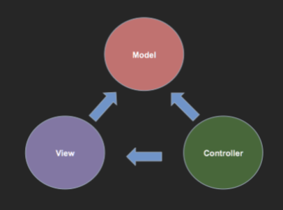
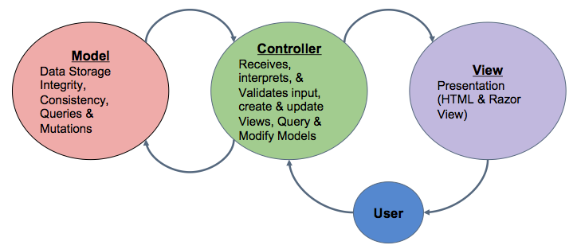
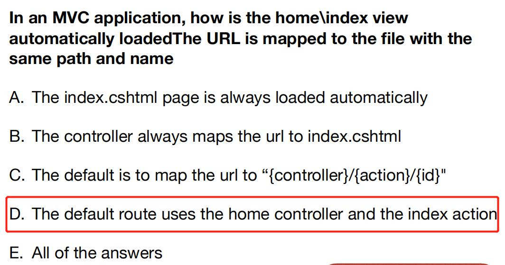
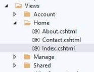
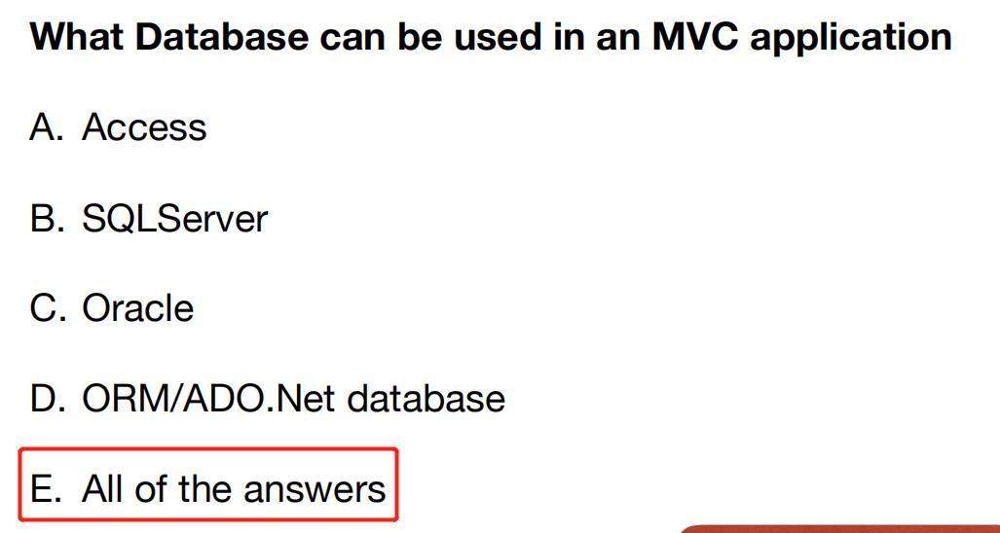
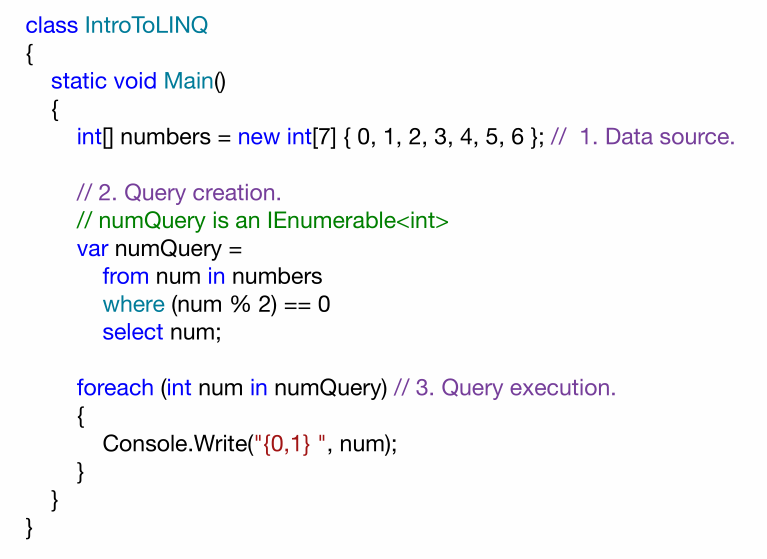
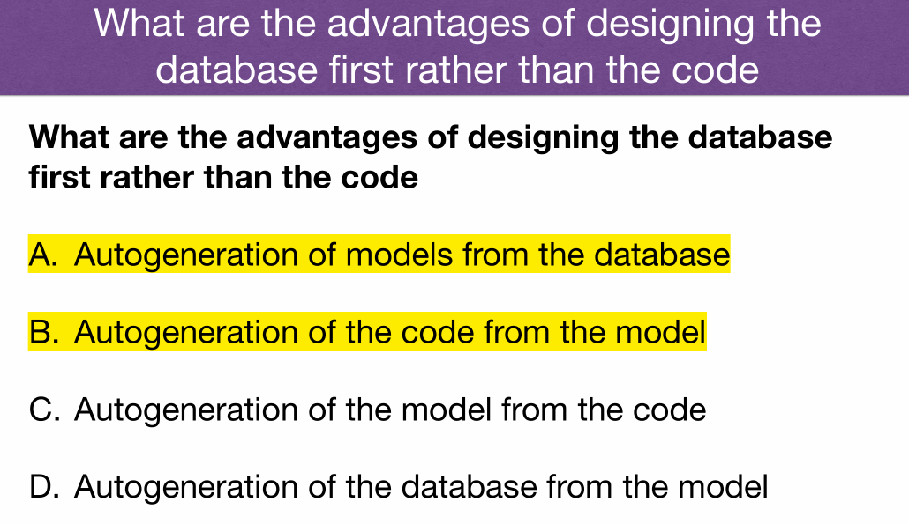
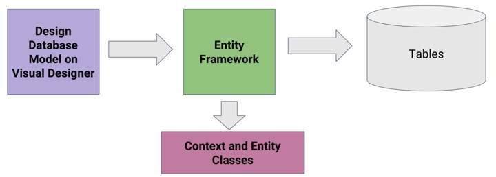
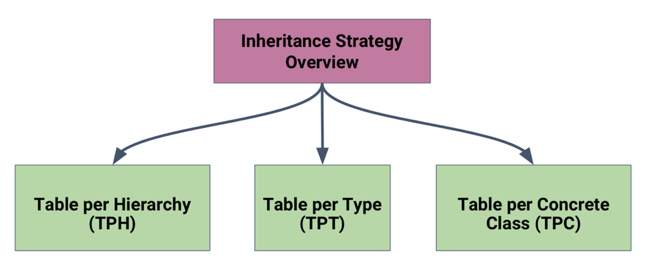
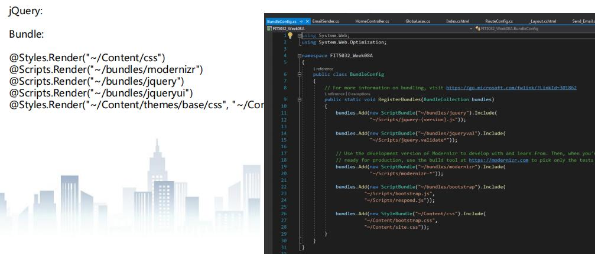

Create time: 2022-10-29  
Last update: {{ git_revision_date }}

# How to use the FIT study Note document
1. download the [markdown file repository](https://github.com/GreenH47/mynote) and  navigate to the `docs` folder
2. view all the markdown files via [Obsidian vault](https://help.obsidian.md/How+to/Working+with+multiple+vaults) that can show the linked section in the note document    
3. You may find some extra material or program template  repository in the Course Brief introduction for the FIT Note markdown Document (some course don't have )

4. you can view [the web page](https://greenh47.github.io/mynote/) which transfer from MD file online but will lose the extra information or wrong    markdown display

# FIT5032 Course Brief introduction

| week | Introduction                               |
| ---- | ------------------------------------------ |
| 1    |  Intro to Web development and ASP.Net.  |
| 2    | The Front End, UX, Accessibility and Scaffolding                 |
| 3    | Introduction to C# & Version Control                       |
| 4    | Entity Framework Scaffolding                           |
| 5    | Fundamental Client Side JavaScript (jQuery; datatable; calendar; maps; rich text)        |
| 6    | Validation                                 |
| 7    | Security & Microsoft Identity  (authentication Login Roles)           |
| 8    | Email, Upload & Signal R                   |
| 9    | Web Optimisations(Reducing HTTP Connections Reducing File sizes Caching Perceived improvements) & Evolution of ASP.NET CORE                               |
| 10   | Modern JavaScript Web Development Approach (AngularJS) |
| 11   | Testing and Deployment in Cloud            |

[](https://github.com/GreenH47/FIT5032_2022s2)

[This repository](https://github.com/GreenH47/FIT5032_2022s2) contents weekly task and my assignment template for [FIT5032 - Internet Application Development](https://handbook.monash.edu/2022/units/FIT5032?year=2022) done for the year 2022. (Semester 2)  

Solutions are working out of the box. (Due to the nature of this unit)  
You can run the project by running the .mdf files which are intentionally in the repository so that it would be working. (some parts are hidden for safety but not influence the framework working)
# FIT5032 week 1 MVC & ASP .net
## Lecture Note
+ Introduction to Internet Applications Development
+ Understand the purpose of ASP.NET MVC
+ Understand the benefits of the MVC architecture
## Q&A part
### ★what is MVC
+ The Model-View-Controller (MVC) architectural pattern separates an application into three main groups of components: Models, Views, and Controllers


### Which action in MVC request & response
  
+ if no model in the project. The `controller` will received the user's command and return  the result to the `VIEW`

### Which functionality/files in each component of MVC?  
  
Model:  
+ database  
+ Defines the data validation rules  
+ contains code that defines its relationship with other models

Controller:  
+ Controls the application flow or logic of the application
+ decides what response is to be generated and passes the response (output) to the  `view`
+  calls to `model` to access data

View:  
+  View is the outputs or responses that are sent back to the user once a request is processed
+ the presentation layer of an application
+ Razor View in .net

### What is Model? Functionality? Responsibilities?
+ A class or set of classes that describes all the business logic and additionally<mark style="background: #3CB371;"> handles data access</mark> for an application.
+ Also contains code that<mark style="background: #3CB371;"> defines its relationship with other models</mark>.
+ Defines the <mark style="background: #3CB371;">data validation rules</mark> to be used when adding or updating data.

### What is Controller? Functionality? Responsibilities?
+ <mark style="background: #ff0000;">Controllers are the components that handle user interaction, work with the model, and ultimately select a view to render.</mark>
+ Controls the <mark style="background: #3CB371;">application flow or logic</mark> of the application
+ Controller logic decides what <mark style="background: #3CB371;">response</mark> is to be generated
+ Controller logic normally contains calls to models to <mark style="background: #0000CD;">access data</mark>, and also other functionalities like access control checks etc
+ Controller passes the response (output) to the view

### What is View? Functionality? Responsibilities?  
+ <mark style="background: #0000CD;">presenting content through the user interface.</mark> They use the Razor view engine to embed .NET code in HTML markup.
+ Consist of markup (like HTML) code with embedded .NET code. Can also be other forms of output like XML, PDF documents etc.
+ Views can be thought of as the <mark style="background: #0000CD;">presentation layer</mark> of an application and ideally should be as "dumb" as possible

### ★★ Advantages of ASP.NET MVC = Why use MVC? = MVC benefit
+ Enables the full control over the rendered HTML (前端可使用逻辑)
+ Provides clean separation of concerns(SoC). (职能可分开)
+  Enables Test Driven Development (TDD).(以method为单位  容易写test)
+  Easy integration with JavaScript frameworks.(容易集成js框架)
+ Following the design of stateless nature of the web. (网页不存数据从model拿数据，不记录用户状态及自身状态)
+ RESTful urls that enables Search Engine Optimisation.(get post in url)
+  No ViewState and PostBack events in comparison to ASP.NET Web Forms ()
### ★★★ Layers/Components in ASP.NET
+ Front End Technology (Razor)
+  .NET (This will be the server side programming technology)
+  IIS (This is the server itself)
+  MS SQL Server
### Separation of Concerns (SOC) 依据功能分成独立几个模块开发
+ 
+ 改变显示去view ， 改变数据多少去controller，改变数据结构去model
+ Is a design principle for separating a computer program into distinct sections, such that <mark style="background: #0000CD;">each section addresses a separate concern</mark>.
+ A concern can be as general as the details of the hardware the code is being optimized for, or as specific as the name of a class to instantiate.
+  The value of separation of concerns is<mark style="background: #3CB371;"> simplifying development and maintenance </mark>of computer programs.
+ When concerns are well-separated, <mark style="background: #0000CD;">individual sections can be reused, as well as developed and updated</mark> independently.
+  For example, user interface logic tends to change more frequently than business logic. If presentation code and business logic are combined in a single object, an object containing business logic must be modified every time the user interface is changed
### Single Responsibility Principle (SRP) 每个模块如何划分 class， reuse
+ The single-responsibility principle (SRP) is a computer-programming principle that states that <mark style="background: #D2691E;">every module, class or function in a computer program should have responsibility over a single part of that program's functionality,</mark> and it should encapsulate that part.

# FIT5032 Week 2 Usability
## Lecture note



## QA part
### ★★★ The 6 Principles Of Design (Donald Norman  举例说明

Visibility  
+ 第一眼要看到所有的 link，并且之后 link 代表的含义
+ Users need to know what all the options are, and know straight away how to access them.
+ For example, on Moodle, the minute you login, it is immediately obvious what the possible options are

Feedback  
+ 网站要针对用户的操作给出反馈，点击有反应
+ Feedback is when a system provides users with information about what has been completed or  accomplished.  
+  One example, is that on the Monash Home page, when the user uses the mouse to hover over  the “Study” option, a drop down menu appears giving feedback to the users’ action.

Affordance  
+ 图标的样式和功能相同，放大镜代表搜索
+ A situation where an object’s sensory characteristics intuitively imply its functionality and use.  
+  When a control behaves as its appearance suggests

Mapping  
+ 图标和文字相对应的表示 link/button 含义
+ Mapping is the relationship between control and effect. The idea is that with good design, the  controls to something will closely resemble what they affect

Constraints   
+ 在同一个页面上，减少和用户的交互（给用户尽可能少的选择）  
+ UI 需要限制当前页面功能的个数，以及引导用户进行下一步操作
+ 单个页面的功能不宜过于复杂
+ Constraints is about limiting the range of interaction possibilities for the user to simplify the  interface and guide the user to the appropriate next action

Consistency  
+ 同级目录/button/link 样式要类似，例如，按 Link 通向相关页面，Button 提交 Action
+ Consistency refers to having similar operations and similar elements for achieving similar tasks.  By leveraging consistent elements throughout your entire experience, you make your experience  far easier to use
### ★★ Web Usability Guidelines (from Flow Bohl)
[](http://www.79er.com/blog/articles/Usability-best-practice-for-UX-design.php)
### ★★★ How to handle request in ASP.Net MVC?  
+ The default route table consists of one route.

 
+ Breaks all incoming requests into three segments (a URL segment is anything between forward slashes).
+  The first segment is mapped to a <mark style="background: #0000CD;">controller name</mark>, `home student)`
+ the second segment is mapped to an <mark style="background: #ff0000;">action name</mark>, `about index`
+ and the final segment is mapped to a <mark style="background: #D2691E;">parameter passed to the action named Id</mark> `123`

### How to combine controller and view/url together? / How to add new view binding with controller?
```csharp
[HttpPost]
public ActionResult Edit(Student std)
{// update student to the database
    return RedirectToAction("Index");
}
```
Add Action Method, the name should be the same name as `view` name. and `view` folder name should be same as `controller`name


### How to return the right view from controller method
+ If you want to return a view from a controller action, you need to  create a <mark style="background: #ff0000;">sub folder in the Views folder with the same name as the  controller</mark>.  
+ 
+ In this subfolder you need to create an .cshtml file with the <mark style="background: #0000CD;">same  name as the controller action</mark>.  `create/delete.cshtml`

### ★★★ What is the role of the layout file in an ASP.Net MVC application? / How to design a website application in the same UI component, same heading image,  same navigation bar?
+ Razor views use a layout to determine their look and feel  
+ The default view is held in `Views/Shared/layout.cshtml`
+ header; footer; navigation bar

### How to render css/js in view/cshtml? (Defer JS)
`@Styles.Render("~/Content/css") `   
is rendered as  
`<link href="/Content/site.css" rel="stylesheet"/>`  
The lines  
```js
@Scripts.Render(“~/bundles/modernizr")  
@Scripts.Render("~/bundles/jquery")  
@Scripts.Render(“~/bundles/bootstraps")
```
are rendered as  
```html
<script src="/Scripts/modernizr-2.8.3.js"></script>  
<script src="/Scripts/jquery-3.4.1.js"></script>  
<script src="/Scripts/bootstraps.js"></script>
```
The JavaScript libraries for jQuery, modernizr, bootstraps are built into the MVC  framework.  

# FIT5032 Week 3 csharp and git
## Lecture note
+ C# Basics: data types and operators
+  C# Language Constructs
+ introduction to Language Integrated Query (LINQ)
+ Git
+ 
## QA
### what is .net
+ .NET is a free, cross-platform, open source developer platform for building many different types of applications.
+ C# is part of the .NET ecosystem
### CLR, IL and JIT
The Common Language Runtime (CLR)  
+ manages the execution of all .NET applications
+ 掌控程序运行，例如 exception handler, 管理 code 等在运行期间的一系列问题  
  
Intermediate language (IL)
+ Program – Intermediate Language – Machine Code
+ 在编译后转换成机器识别的语言  
  
The JIT (Just-In-Time) compile
+ 在运行时 compile，有问题时报错或者 throw exception  实时编译

###  ★ C#，Java , JS
| feature            | c#  | java | js  |
| ------------------ | --- | ---- | --- |
| Strongly Typed     | y   | y    |     |
| Object Oriented    | y   | y    |     |
| Component-oriented | y   |      |     |

### Object Oriented
+ Abstraction 抽象 interface
+ Encapsulation 封装 class
+ Inheritance 继承 super class
+ Polymorphism 多态 override  

### ★ Component Oriented Programming
+ 功能封装为Component 然后复用
+ A technique of developing software applications by combining preexisting and new components.
+  Heavily relies on: polymorphism, encapsulation, late binding, inheritance (through interfaces) and most importantly binary re-usability

### Differ between ToString() & Convert.ToString()
```csharp
int age = 35;  
string strAge1 = age.ToString();  
string strAge2 = Convert.ToString(age);
```
Convert.ToString() function can handle null values  
ToString() can not handle null values
### ★★  C# Comparison Operators
```
== Equality  
!= OR <> Inequality  
< Less Than  
> Greater Than  
<= Less Than or Equal To  
>= Greater Than or Equal To
??  null-coalescing operator. 
It returns the left-hand operand if the operand is not null; otherwise it returns the right hand operand
?. Null-conditional operator 
returns null if the  left-hand operand evaluates to null
=> lambda operator. 
It is used in lambda  expressions to separate the input variables on the left side from  the lambda body on the right side
```
### # What is difference between `String` and `string`
+ `string` is just an alias of `System.String` so there is no difference.
+ `string` is just a keyword mainly used in creating a variable
+ `System.String` is a class which gives you a rich set of functions and properties to manipulate the string
### C# Logical Operators
```
&& And  
|| OR  
! NOT
```
### ★★Language Integrated Query (LINQ)
+ LINQ offers a consistent model for working with data across various kinds of data sources and formats.
+ <mark style="background: #3CB371;">Always working with objects</mark>.
+  All LINQ query operations consist of three distinct actions <mark style="background: #0000CD;">Obtain the data source; Create the query; Execute the query</mark>  


### ★★LINQ VS SQL
+ Generally, when querying databases, LINQ is in most cases a  significantly more productive querying language than SQL
+ When it runs, LINQ to SQL translates into SQL in the object model and sends them to the database for  execution. When the database returns the result, LINQ to SQL translates  them back to objects  
  


# ★★★FIT5032 Week 4 Entity Framework Scaffolding
## Lecture note
  

## QA
### what is Scaffolding? why use? benefit
+ A code generation framework for ASP.NET Web  applications.  
+ Easy to add boilerplate code to your project that  interacts with a data model.  
+ Can reduce the amount of time to develop standard  data operations in your project.  
+ Can quickly add needed controllers and view that will  interact with models
###   What is Entity Framework / benefit / Why use?  
+ 
+ The Entity Framework is a set of technologies that support the <mark style="background: #3CB371;">development of data-oriented</mark> software applications.
+  Entity Framework is an object-relational mapper (ORM) that reduces the impedance mismatch between the object-oriented world of .NET Framework developers and the world of relational databases
+ It saves data stored in the properties of  business entities and also retrieves data  from the database and converts it to  business entities objects automatically.
### ★★★What is ORM/Advantages and Disadvantages
+ Object-Relational Mapping (ORM) is a technique that  lets you query and manipulate data from a database  using an object-oriented paradigm   


### What are the Impedance Mismatch in ORM?

+ Encapsulation – in OOP every class has internal and private implementation that is  contained and maintained by the class instance. (RDMS uses “public” data 封装后 class中private的data 和function无法在DB映射
+ Data type differences – no pointer/reference data types are allowed in the relational  systems. oop中的数据类型(string int)在关系型数据库中会变成(varchar number)
+ Structure and integrity – in OOP it is considered normal to have highly nested structures (objects containing sets of different objects recursively, thus producing quite complicated object graphs).oop中的复杂嵌套关系，在数据库中可能无法正常转译
### Core abilities in EF API

### What context class do in EF?

```csharp
public class AppDbContext : DbContext
{
    public AppDbContext(DbContextOptions<AppDbContext> options)
        : base(options)
    {
    }

    public DbSet<Employee> Employees { get; set; }
    public DbSet<Department> Employees { get; set; }
}
```
### What is Entity in EF?
+ An entity in Entity Framework is a<mark style="background: #ff0000;"> class in the domain of  your application</mark> which is included as a `DbSet<TEntity>`  type property in the derived context class.  
+ An Entity can include two types of properties: <mark style="background: #3CB371;">Scalar  Properties and Navigation Properties</mark>
### how to build model
+ database First Approach (This is where a database is  created first using Data Definition Language. So, you  are writing SQL first)  
+ Model First Approach (This is where a Visual Designer  is used or the model is mapped out via XML  configuration files)  
+ Code First Approach (This is when Code (C# classes)  are written or created)
### Development Workflow

###  A General Guideline

### ★ What is Model First Approach
create the entities,  relationships, and inheritance hierarchies directly on the  design surface of EDMX and then generate the  database from your model   
<mark style="background: #0000CD;">draw table and relationship -> generate and execute SQL -> generate Model </mark>

### ★ What is Code First Approach
<mark style="background: #3CB371;">Create Entity -> Create Context Class -> Generate Tables in DB</mark>  

### ★★★Advantages and Disadvantages of Code First
Advantages  
+ Ability to “version” control database
+ Reduces the amount of automatically generated code significantly
+ A “developer” centric approach  
  
Disadvantages  
+ Difficult if new to the C# environment and already know SQL.
+ Heavily depends on the architecture of the systems in use, using it may be more difficult in scenarios where the database layer is important.
### ★ Advantages and Disadvantages of DB First
Advantages  
+ Assumes that the database design does not change over time. 
+ Knowledge of SQL will make this task significantly easier in  comparison to Code First.  

Disadvantages  
+ Requires an understanding of SQL to create the Database.  
+  Changes to the database can negatively impact development as  auto-generated codes may not be working as intended  
+ Lack the correct annotation attributes (sometimes)
### Inheritance Strategy

### Eager Loading and Lazy Loading
 Eager Loading  
+  Eager loading is the process whereby a query for one type of entity also <mark style="background: #3CB371;">loads related entities </mark>as part of the query.
+ <mark style="background: #D2691E;">This is done so that we do not need to write a separate query for the related entity type</mark>.
+ Eager loading is achieved using the Include() method.  
  
Lazy Loading
+ The loading of related data, only happens when it is request

# FIT5032 Week 5 JS
## Lecture note

## QA
### ★★ What is JS(JavaScript) / features
+ JavaScript is a lightweight, interpreted or JIT compiled programming  language with first class function
+ JavaScript is a prototype-based, multi-paradigm, dynamic scripting  language, supporting object-oriented, imperative and declarative styles

### ★★ What’s difference between Server-side vs Client-side code? How can browser/ client PC run dynamic logic? Use JS
+ Client-side code is code  that is r<mark style="background: #0000CD;">an on the user’s  computer</mark> - when the page is viewed, the <mark style="background: #3CB371;">client side  code is downloaded and then run and displayed by the  browser</mark>. This is what we call client-side JavaScript. <mark style="background: #D2691E;">(write on  html) </mark> (vue jquery)
+ JavaScript can also be used as server-side.<mark style="background: #ff0000;">(write on mvc)</mark> Recently,  there is a huge surge in the popularity of using  JavaScript as server side code in the Node.js  environment(Node.js)
### ★★ JavaScript Libraries and Framework
+ JavaScript library: <mark style="background: #0000CD;">pre-written JavaScript which allows for easier development  of JavaScript applications.</mark> Examples of JavaScript libraries(jQuery d3.js) are `<script src="/Scripts/modernizr-2.8.3.js"></script>`
+ JavaScript framework: A framework <mark style="background: #3CB371;">defines the entire application design</mark>.  Examples of JavaScript frameworks are(vue react)
### ★★ Briefly describe how the bundling of CSS and JavaScript files is  implemented in ASP.Net MVC applications

### How to add new external JS lib in .Net App?
+ js file to `Scripts` folder; css file to `Content` folder
+ configure those file in `BundleConfig.cs`
+ import the bundle in `layout.cshtml`  or other page `@Styles.Render("~/Content/css")` `@Scripts.Render("~/bundles/modernizr")`
### Styles.Render() and Scripts.Render()
[How to render css/js in view/cshtml? (Defer JS)](#How%20to%20render%20css/js%20in%20view/cshtml?%20(Defer%20JS))
+ Style.Render is used to render a bundle of CSS files defined within BundleConfig.cs files. Styles.Render create style tag(s) for the CSS bundle
+ Scripts.Render is also used to render a bundle of Script files by rendering script tag(s) for the Script bundle.
### ★★ JS defer
+ Scripts with the defer attribute are executed in order (i.e. first script 1, then script 2). This  also does not block the browser.  
+ 延迟标签会按顺序激活  
+ 激活时机是在整体页面全部被 load 之后  
+ 缺陷：如果 JS 很多或者页面很大，页面延迟会特别高
```html
<script src="path/to/script1.js" defer></script>  
<script src="path/to/script2.js" defer></script>
```
### ★★ html async
+ Scripts with the async attribute are executed asynchronously.  
+ 异步标签控制 script 可以在下载同时解析之后的 tag（HTML）  
+ 使用场景，此 script 对页面的初次加载不是必不可少的，类似网页动画
+ 缺陷：再有多个 JS 的时候，谁先下载完毕，谁先执行，没有 sequence 控制
```html
<script src="path/to/script1.js" async></script>  
<script src="path/to/script2.js" async></script>  
<script async src="my.js"></script>
```
# FIT5032 Week 6 Validation
## Lecture note
## QA