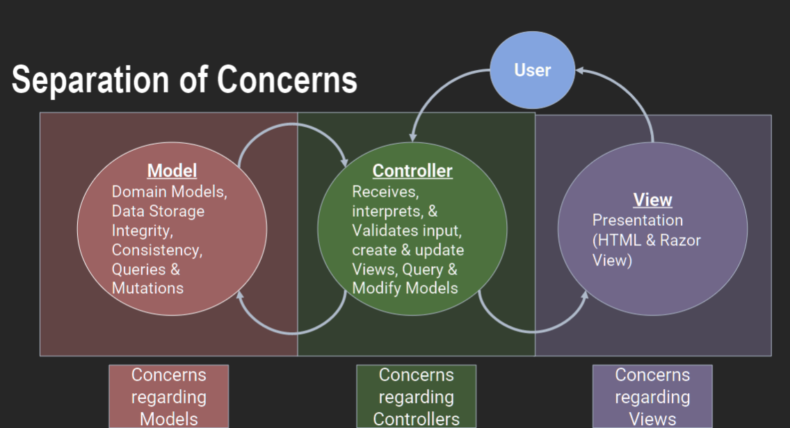
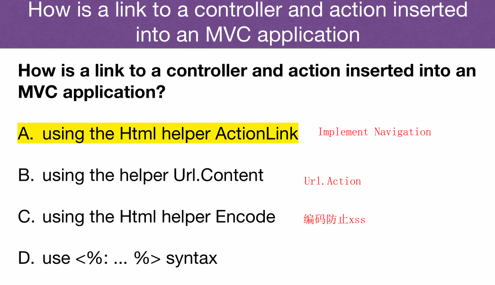
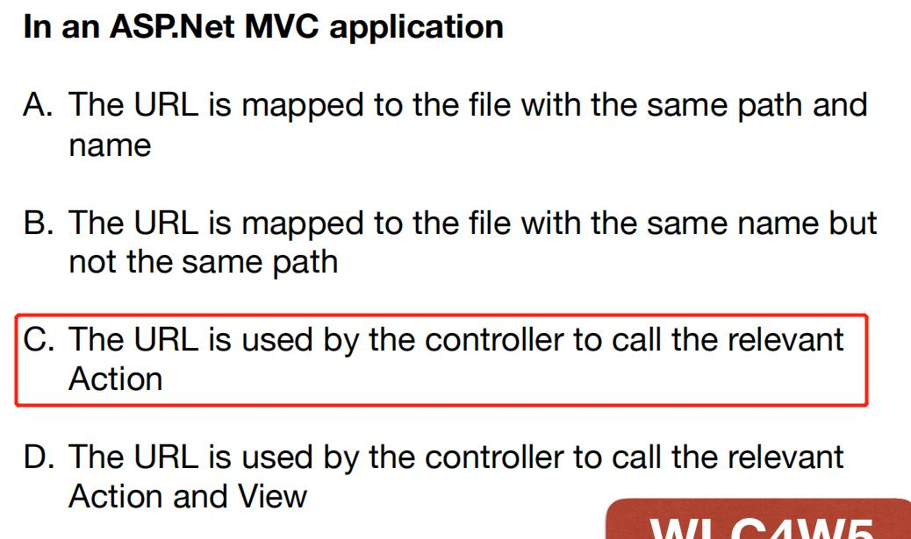
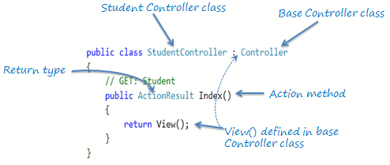

Create time: 2022-10-29  
Last update: {{ git_revision_date }}

# How to use the FIT study Note document
1. download the [markdown file repository](https://github.com/GreenH47/mynote) and  navigate to the `docs` folder
2. view all the markdown files via [Obsidian vault](https://help.obsidian.md/How+to/Working+with+multiple+vaults) that can show the linked section in the note document    
3. You may find some extra material or program template  repository in the Course Brief introduction for the FIT Note markdown Document (some course don't have )

4. you can view [the web page](https://greenh47.github.io/mynote/) which transfer from MD file online but will lose the extra information or wrong    markdown display

# FIT5032 Course Brief introduction

| week | Introduction                               |
| ---- | ------------------------------------------ |
| 1    |  Intro to Web development and ASP.Net.  |
| 2    | The Front End, UX, Accessibility and Scaffolding                 |
| 3    | Introduction to C# & Version Control                       |
| 4    | Entity Framework                           |
| 5    | Fundamental Client Side JavaScript (jQuery; datatable; calendar; maps; rich text)        |
| 6    | Validation                                 |
| 7    | Security & Microsoft Identity  (authentication Login Roles)           |
| 8    | Email, Upload & Signal R                   |
| 9    | Web Optimisations(Reducing HTTP Connections Reducing File sizes Caching Perceived improvements) & Evolution of ASP.NET CORE                               |
| 10   | Modern JavaScript Web Development Approach (AngularJS) |
| 11   | Testing and Deployment in Cloud            |

[](https://github.com/GreenH47/FIT5032_2022s2)

[This repository](https://github.com/GreenH47/FIT5032_2022s2) contents weekly task and my assignment template for [FIT5032 - Internet Application Development](https://handbook.monash.edu/2022/units/FIT5032?year=2022) done for the year 2022. (Semester 2)  

Solutions are working out of the box. (Due to the nature of this unit)  
You can run the project by running the .mdf files which are intentionally in the repository so that it would be working. (some parts are hidden for safety but not influence the framework working)
# FIT5032 week 1 MVC & ASP .net
## Lecture Note
+ Introduction to Internet Applications Development
+ Understand the purpose of ASP.NET MVC
+ Understand the benefits of the MVC architecture
## Q&A part
### ★what is MVC
+ The Model-View-Controller (MVC) architectural pattern separates an application into three main groups of components: Models, Views, and Controllers


### Which action in MVC request & response
  
+ if no model in the project. The `controller` will received the user's command and return  the result to the `VIEW`

### Which functionality/files in each component of MVC?  
  
Model:  
+ database  
+ Defines the data validation rules  
+ contains code that defines its relationship with other models

Controller:  
+ Controls the application flow or logic of the application
+ decides what response is to be generated and passes the response (output) to the  `view`
+  calls to `model` to access data

View:  
+  View is the outputs or responses that are sent back to the user once a request is processed
+ the presentation layer of an application
+ Razor View in .net

### What is Model? Functionality? Responsibilities?
+ A class or set of classes that describes all the business logic and additionally<mark style="background: #3CB371;"> handles data access</mark> for an application.
+ Also contains code that<mark style="background: #3CB371;"> defines its relationship with other models</mark>.
+ Defines the <mark style="background: #3CB371;">data validation rules</mark> to be used when adding or updating data.

### What is Controller? Functionality? Responsibilities?
+ <mark style="background: #ff0000;">Controllers are the components that handle user interaction, work with the model, and ultimately select a view to render.</mark>
+ Controls the <mark style="background: #3CB371;">application flow or logic</mark> of the application
+ Controller logic decides what <mark style="background: #3CB371;">response</mark> is to be generated
+ Controller logic normally contains calls to models to <mark style="background: #0000CD;">access data</mark>, and also other functionalities like access control checks etc
+ Controller passes the response (output) to the view

### What is View? Functionality? Responsibilities?  
+ <mark style="background: #0000CD;">presenting content through the user interface.</mark> They use the Razor view engine to embed .NET code in HTML markup.
+ Consist of markup (like HTML) code with embedded .NET code. Can also be other forms of output like XML, PDF documents etc.
+ Views can be thought of as the <mark style="background: #0000CD;">presentation layer</mark> of an application and ideally should be as "dumb" as possible

### ★★ Advantages of ASP.NET MVC = Why use MVC? = MVC benefit
+ Enables the full control over the rendered HTML (前端可使用逻辑)
+ Provides clean separation of concerns(SoC). (职能可分开)
+  Enables Test Driven Development (TDD).(以method为单位  容易写test)
+  Easy integration with JavaScript frameworks.(容易集成js框架)
+ Following the design of stateless nature of the web. (网页不存数据从model拿数据，不记录用户状态及自身状态)
+ RESTful urls that enables Search Engine Optimisation.(get post in url)
+  No ViewState and PostBack events in comparison to ASP.NET Web Forms ()
### ★★★ Layers/Components in ASP.NET
+ Front End Technology (Razor)
+  .NET (This will be the server side programming technology)
+  IIS (This is the server itself)
+  MS SQL Server
### Separation of Concerns (SOC) 依据功能分成独立几个模块开发
+ 
+ 改变显示去view ， 改变数据多少去controller，改变数据结构去model
+ Is a design principle for separating a computer program into distinct sections, such that <mark style="background: #0000CD;">each section addresses a separate concern</mark>.
+ A concern can be as general as the details of the hardware the code is being optimized for, or as specific as the name of a class to instantiate.
+  The value of separation of concerns is<mark style="background: #3CB371;"> simplifying development and maintenance </mark>of computer programs.
+ When concerns are well-separated, <mark style="background: #0000CD;">individual sections can be reused, as well as developed and updated</mark> independently.
+  For example, user interface logic tends to change more frequently than business logic. If presentation code and business logic are combined in a single object, an object containing business logic must be modified every time the user interface is changed
### Single Responsibility Principle (SRP) 每个模块如何划分 class， reuse
+ The single-responsibility principle (SRP) is a computer-programming principle that states that <mark style="background: #D2691E;">every module, class or function in a computer program should have responsibility over a single part of that program's functionality,</mark> and it should encapsulate that part.

# FIT5032 Week 2 Usability
## Lecture note



## QA part
### ★★★ The 6 Principles Of Design (Donald Norman  举例说明

Visibility  
+ 第一眼要看到所有的 link，并且之后 link 代表的含义
+ Users need to know what all the options are, and know straight away how to access them.
+ For example, on Moodle, the minute you login, it is immediately obvious what the possible options are

Feedback  
+ 网站要针对用户的操作给出反馈，点击有反应
+ Feedback is when a system provides users with information about what has been completed or  accomplished.  
+  One example, is that on the Monash Home page, when the user uses the mouse to hover over  the “Study” option, a drop down menu appears giving feedback to the users’ action.

Affordance  
+ 图标的样式和功能相同，放大镜代表搜索
+ A situation where an object’s sensory characteristics intuitively imply its functionality and use.  
+  When a control behaves as its appearance suggests

Mapping  
+ 图标和文字相对应的表示 link/button 含义
+ Mapping is the relationship between control and effect. The idea is that with good design, the  controls to something will closely resemble what they affect

Constraints   
+ 在同一个页面上，减少和用户的交互（给用户尽可能少的选择）  
+ UI 需要限制当前页面功能的个数，以及引导用户进行下一步操作
+ 单个页面的功能不宜过于复杂
+ Constraints is about limiting the range of interaction possibilities for the user to simplify the  interface and guide the user to the appropriate next action

Consistency  
+ 同级目录/button/link 样式要类似，例如，按 Link 通向相关页面，Button 提交 Action
+ Consistency refers to having similar operations and similar elements for achieving similar tasks.  By leveraging consistent elements throughout your entire experience, you make your experience  far easier to use
### ★★ Web Usability Guidelines (from Flow Bohl)
[](http://www.79er.com/blog/articles/Usability-best-practice-for-UX-design.php)
### ★★★ How to handle request in ASP.Net MVC?  
+ The default route table consists of one route.

 
+ Breaks all incoming requests into three segments (a URL segment is anything between forward slashes).
+  The first segment is mapped to a <mark style="background: #0000CD;">controller name</mark>, `home student)`
+ the second segment is mapped to an <mark style="background: #ff0000;">action name</mark>, `about index`
+ and the final segment is mapped to a <mark style="background: #D2691E;">parameter passed to the action named Id</mark> `123`

### How to combine controller and view/url together? / How to add new view binding with controller?
```csharp
[HttpPost]
public ActionResult Edit(Student std)
{// update student to the database
    return RedirectToAction("Index");
}
```
Add Action Method, the name should be the same name as `view` name. and `view` folder name should be same as `controller`name


### How to return the right view from controller method
+ If you want to return a view from a controller action, you need to  create a <mark style="background: #ff0000;">sub folder in the Views folder with the same name as the  controller</mark>.  
+ 
+ In this subfolder you need to create an .cshtml file with the <mark style="background: #0000CD;">same  name as the controller action</mark>.  `create/delete.cshtml`

### ★★★ What is the role of the layout file in an ASP.Net MVC application? / How to design a website application in the same UI component, same heading image,  same navigation bar?
+ Razor views use a layout to determine their look and feel  
+ The default view is held in `Views/Shared/layout.cshtml`
+ header; footer; navigation bar

### How to render css/js in view/cshtml? (Defer JS)
`@Styles.Render("~/Content/css") `   
is rendered as  
`<link href="/Content/site.css" rel="stylesheet"/>`  
The lines  
```js
@Scripts.Render(“~/bundles/modernizr")  
@Scripts.Render("~/bundles/jquery")  
@Scripts.Render(“~/bundles/bootstraps")
```
are rendered as  
```html
<script src="/Scripts/modernizr-2.8.3.js"></script>  
<script src="/Scripts/jquery-3.4.1.js"></script>  
<script src="/Scripts/bootstraps.js"></script>
```
The JavaScript libraries for jQuery, modernizr, bootstraps are built into the MVC  framework.  

# FIT5032 Week 3 csharp and git
## Lecture note
## QA
